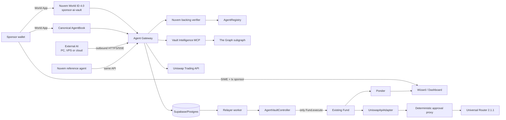

# Arquitectura — Nuvem Agents + BYOA

## Resultado

Un vault puede seguir gestionado directamente por una wallet humana o usar un
`AgentVaultController` como manager. En el segundo caso, el sponsor humano conserva stake, fees,
pausa, rotación y cierre; el agente solo puede presentar intenciones firmadas dentro de una política
on-chain.



## Onboarding World de baja fricción

El sponsor elige una de dos rutas, pero ambas terminan en el mismo `AgentRegistry` y el mismo
controller:

### Nuvem reference

1. El sponsor abre una sesión SIWE.
2. `POST /v1/managed-signers` crea una identidad aislada por vault. La respuesta contiene solo
   `agentId` y dirección pública; nunca private key, seed ni prompt.
3. La wallet sponsor registra esa dirección en `AgentRegistry` sobre Robinhood Chain.
4. El gateway firma un request RP de la app **Nuvem Fund** para la action `sponsor-ai-vault`. El
   signal liga chain, `agentId`, sponsor y signer. La RP key queda exclusivamente en backend.
5. El sponsor confirma la action propia en World App. El gateway reenvía el proof opaco al endpoint
   World ID 4.0, comprueba nonce/action/signal y consume el request una sola vez.
6. Postgres guarda únicamente HMACs/hashes. La primera prueba liga un humano anónimo a la wallet
   sponsor; futuros agentes de esa misma wallet reutilizan el vínculo sin otro scan. El límite de
   tres agentes Nuvem se aplica con advisory lock por hash humano.
7. El wizard pide después el nonce canónico de AgentBook y crea el request oficial ligado a
   `(agent signer, nonce)`.
8. El proof AgentBook se relayea y confirma en World Chain. El gateway exige ambas evidencias y
   combina sus hashes en la atestación EIP-712; ninguna de las dos activa un vault por sí sola.
9. El sponsor activa el backing en Robinhood y el worker ya puede desplegar controller/Fund.

El QR se genera localmente; no se envía el connector URI a un servicio de imágenes. Existe fallback
CLI (`npx @worldcoin/agentkit-cli@0.2.0 register <signer>`) si World App no puede abrir el deep link.

### External / BYOA

El manager introduce únicamente la dirección de su signer local. Completa la misma action propia de
Nuvem y el mismo registro AgentBook; la private key permanece en su PC/VPS y Nuvem no puede derivarla.
Después, AgentKit abre sesiones salientes HTTPS de 15 minutos y cada trade sigue exigiendo una firma
EIP-712 independiente.

La app propia usa `app_5fe197d24d83c55573c5d9d0356f3d6`, RP `rp_db7d77ff9edef255` y action
`sponsor-ai-vault`. El registro AgentBook sigue usando deliberadamente la app/action oficial de
AgentKit (`app_a7c3e2b6b83927251a0db5345bd7146a` / `agentbook-registration`). Son controles
complementarios: Nuvem verifica al sponsor y AgentBook verifica el signer agente.

La implementación `local-derived-v1` permite devnet/canario y no persiste claves, pero el backend que
posee el secreto raíz puede derivarlas. Producción pública requiere sustituirla por `kms-v1`/HSM con
claves no exportables, rotación y separación operacional.

## Fronteras de confianza

| Actor | Puede | No puede |
|---|---|---|
| Sponsor | Registrar, pausar, rotar signer, cambiar policy con timelock, winding/cierre, aportar/retirar stake según reglas | Redirigir capital LP o saltarse el lifecycle del Fund |
| Agente | Firmar una intención EIP-712 para su controller y nonce | Enviar calldata arbitraria, cambiar política, recipient o adapter |
| Gateway | Preparar contexto/quote, validar, persistir y relayar | Autorizar fondos sin firma del agente |
| Relayer | Pagar gas y llamar `executeTrade` | Crear una intención válida, reutilizar nonce o exceder policy |
| World ID RP | Verificar al sponsor con la action Nuvem y emitir un vínculo hasheado | Ver, guardar o revelar la identidad humana real |
| World backing verifier | Atestar que coinciden sponsor Nuvem + signer AgentBook | Operar el Fund ni sustituir al sponsor |
| The Graph | Proporcionar contexto con provenance | Autorizar una transacción; datos stale hacen fail-closed |
| Uniswap API | Proponer quote y calldata | Elegir otro target/campos sin ser rechazado por gateway, SDK, controller y adapter |

## Contratos

### AgentRegistry

- Estado: `PendingBacking`, `Active`, `Paused`, `Retired`.
- Vincula `agentId`, sponsor, signer, controllers y `metadataURI`.
- La atestación World está ligada por EIP-712 a chain, registry, sponsor, signer, backing hash,
  bloque AgentBook, caducidad y nonce.
- Rotar, pausar, reanudar o retirar invalida backing/nonces anteriores inmediatamente.
- Acepta verifier EOA o EIP-1271; no publica el identificador humano de AgentBook.

World describe AgentKit como beta, el registro del signer en AgentBook sobre World Chain y el lookup
canónico en World Chain aunque el agente opere en otra red:
[documentación oficial](https://docs.world.org/agents/agent-kit/integrate).

### AgentVaultController

Es un contrato por vault y se pasa como `MANAGER` al constructor existente del Fund.

- Dominio EIP-712: chain ID + dirección concreta del controller.
- Nonce secuencial; ventana máxima de intención de cinco minutos.
- Comprueba agente activo, controller autorizado, `policyHash`, `executionHash`, `evidenceHash` y firma.
- Solo llama al adapter fijado y luego a `Fund.execute`; no expone un executor arbitrario.
- NAV y precios válidos antes/después; mide balances reales del Fund.
- Aplica tamaño, concentración, turnover, trades/día, intervalo y slippage observado.
- USDG está exento de concentración; vender un activo suspendido sigue siendo posible para reducir
  riesgo, pero comprar exige asset permitido.
- Una postcondición fallida revierte atómicamente también el swap.
- Cambios de policy: timelock de 24 horas. Pausa y rotación: inmediatas.
- Fees, tokens y ETH del manager solo pueden barrerse al sponsor fijo.

Política inicial:

| Control | Default | Rango on-chain |
|---|---:|---:|
| Trade máximo | 10% NAV | 1–20% |
| Concentración | 35% NAV | 10–50% |
| Turnover diario | 50% NAV | 5–100% |
| Slippage | 0.75% | 0.10–1% |
| Trades diarios | 24 | 1–200 |
| Intervalo | 5 min | 1–60 min |
| Vida de intención | 5 min | 1 s–5 min |

### UniswapApiAdapter

El backend solicita exact-input con `swapper=adapter`, `recipient=fund`,
`x-permit2-disabled: true` y Universal Router `2.1.1`. Solo acepta `CLASSIC`.

La misma llamada se valida en cuatro niveles:

1. Gateway: target, from, chain, value, selector y campos del proxy.
2. SDK local: vuelve a decodificar selector, tokens, amount y deadline antes de firmar.
3. Controller: fija adapter/ID, hash completo y `minAmountOut`.
4. Adapter: aprobación exacta, ejecución, revocación, delta del Fund y cero residuos.

Uniswap documenta Robinhood Chain 4663 con Universal Router 2.1.1 y el flujo no-Permit2 mediante
proxy determinístico. La tabla específica del proxy no lista hoy Robinhood, aunque el contrato sí
tiene bytecode en el fork; por ello el API real continúa como gate de promoción y no se declara live:
[chains](https://developers.uniswap.org/docs/trading/swapping-api/supported-chains),
[proxy approval](https://developers.uniswap.org/docs/trading/swapping-api/concepts/no-permit2-workflow).

## Control plane y persistencia

`apps/agent-gateway` expone Hono/OpenAPI. Toda mutación exige `Idempotency-Key` y las sesiones opacas
AgentKit duran 15 minutos. La sesión permite usar la API, pero una transacción monetaria siempre
requiere la firma EIP-712 local.

Estados:

```text
proposed -> quoted -> signed -> queued -> submitted -> confirmed
                                       \-> rejected | expired | failed
```

El worker de trades persiste calldata firmado antes de broadcast, recupera receipts tras reinicio y
no duplica una tx si cae después de transmitirla. El worker de creación reserva tres nonces
contiguos, firma/persiste controller + Fund + register antes del primer broadcast, y espera las
transacciones sponsor de bind/stake para marcar el vault como listo.

Supabase separa:

- `agent_private`: challenges, sesiones, nonces, jobs, quotes, intents, policy evaluations,
  execution attempts, receipts, World attestations, identidades gestionadas públicas,
  requests RP de un solo uso, sponsors/agentes World hasheados y audit append-only.
- `agent_profiles` y `agent_decisions`: superficie pública sanitizada bajo RLS.

No se persisten private keys, API keys, prompts privados ni identificadores humanos en claro. Toda la
schema `agent_private` tiene RLS sin políticas de navegador; `anon` y `authenticated` no tienen grants.

## Datos de agentes

The Graph es la fuente load-bearing del agente y Ponder continúa como read model del frontend. El
MCP ofrece ocho herramientas read-only y adjunta deployment ID, bloque y timestamps. Si la fuente
está más de 20 bloques o dos minutos atrasada, el gateway rechaza quotes nuevas. Robinhood figura en
las [redes soportadas por The Graph](https://thegraph.com/docs/en/supported-networks/).

## Propiedades demostradas y pendientes

Demostrado localmente: vault AI, stake, LP sin KYC, fee al sponsor, límite on-chain, trade válido,
replay, Ponder, reinicio lógico y rotación. Demostrado por unit tests: AgentKit replay/challenge,
Nuvem World nonce/action/signal/replay/cuota, World canonical verifier, worker crash/concurrencia,
Graph stale y errores de Uniswap. El esquema World ID 4.0 también pasó un smoke real contra
Postgres NuvemFund con limpieza posterior.

La app/RP/action de Nuvem están registradas y activas. Pendiente de evidencia pública: un scan real
visible en el dashboard World, AgentBook real, subgraph desplegado, quote real de Trading API,
deployment Agents en 46630 y canario mínimo 4663. Ninguna de esas ausencias se sustituye por un mock silencioso.
