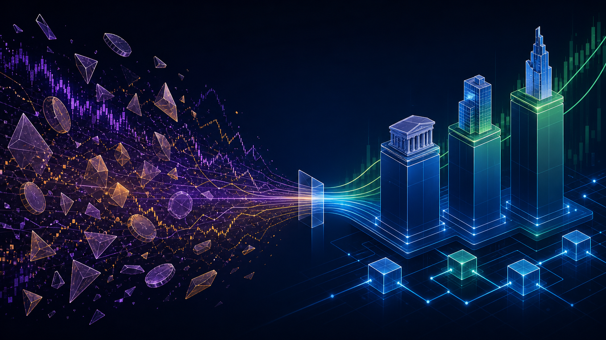

# Nuvem.Fund: Where Great Traders, Communities, and Real Stocks Meet

> **Backing great traders. Building investor communities. Trading real stocks — onchain.**


The next generation of investing will not be built around anonymous charts or isolated brokerage accounts.

It will be built around people with a demonstrable edge, communities that can learn and act together, and assets whose value is grounded in the real world.

That is the idea behind **Nuvem.Fund**.

We are building a social investing protocol for Robinhood Chain: a place where strong traders can launch transparent onchain funds using tokenized equities, and where eligible investors can back them, follow their decisions, and become part of the community around the strategy.

Nuvem is currently being tested on devnet. This is our thesis for why the timing matters.

---

## 1. A better deal for great traders — and the people who back them

Great traders create value, but today that value is difficult to package fairly.

Their audience may follow posts, copy trades manually, join private groups, or pay subscriptions. None of those models creates a transparent, shared financial relationship between a trader and the people who believe in them.

Nuvem turns a trader's strategy into an onchain fund.

- A manager launches a fund with a clear mandate and transparent track record.
- The manager locks personal capital as **skin in the game**. It acts as a first-loss layer: the manager has something real at risk before investors bear losses.
- Eligible investors deposit stablecoins and receive fund shares whose value is tied to the fund's onchain NAV.
- The manager can execute approved trades, but cannot withdraw investor principal.
- Investors can enter and exit through a designed liquidity process, instead of trusting screenshots or sending money to a person.

This is not about making every influencer a fund manager. It is about giving genuinely capable traders a better way to build a reputation, a business, and a long-term community — with accountability built into the product.

For investors, the experience should feel simple: find a trader you believe in, understand the risk, see the alignment, and decide whether you want exposure.

---

## 2. Why Robinhood Chain is the missing infrastructure

For years, crypto has been excellent at creating financial primitives, but most of the assets being composed were native crypto assets. Robinhood Chain changes the input.

Robinhood Stock Tokens are standard ERC-20 tokens that provide economic exposure to underlying US equities and ETFs. They can be held in wallets, transferred, and used inside smart contracts like other ERC-20s. Each token has an onchain Chainlink price feed, allowing a fund contract to calculate its holdings' value directly onchain.

That makes a structure like Nuvem possible:

```text
Real stock exposure
        +
Onchain pricing and settlement
        +
Smart-contract fund rules
        +
Trader-led communities
        =
Nuvem.Fund
```

Robinhood Chain is particularly suited to this because it was built around tokenized real-world assets. Its stock-token design also handles corporate actions through an onchain multiplier: dividends and splits can be reflected in a token's economic exposure without a fund needing to manually rebuild its accounting.

That matters. A social fund should not need to depend on spreadsheets, screenshots, or a centralized operator to explain what it owns. The holdings, relevant prices, fund NAV, and manager actions can be made legible onchain.

Of course, the product must respect the constraints of the asset. Robinhood Stock Tokens are issued debt securities, not direct beneficial ownership of the underlying shares, and their distribution is restricted in several jurisdictions. Nuvem is being designed around eligibility and compliance controls from day one; it is not intended for every person or every market.

---

## 3. The market has changed — and attention is moving with it

There is a reason this matters now.

US equities have had an extraordinary run. The S&P 500 returned roughly **24% in 2023**, **23% in 2024**, and **nearly 18% in 2025** on a price-return basis. The exact future is unknowable, and past performance is never a promise — but the direction of attention is obvious: public markets, AI-led companies, infrastructure, and earnings narratives are back at the center of the conversation.



Meanwhile, crypto markets have become more selective. Bitcoin and a small set of majors can still command enormous liquidity, but broad altcoin participation is no longer a reliable assumption. Liquidity, attention, and performance have become far more dispersed.

The conclusion is not that crypto is over. Crypto is the technology layer. But the next wave of useful onchain products may be built around assets people already understand and care about: companies, sectors, ETFs, cash flows, and macro views.

Nuvem sits at that intersection: crypto-native coordination and transparency applied to equity exposure.

### Three recent years of equity momentum


| Year | S&P 500 price return | What it signalled |
| --- | ---: | --- |
| 2023 | ~24% | Recovery and concentration in large-cap technology |
| 2024 | 23.3% | A second consecutive year above 20% |
| 2025 | ~18% | A third strong year despite volatility and macro shocks |

*Sources: S&P Dow Jones Indices and AP year-end market reporting. These are historical figures, not forecasts or investment advice.*

The opportunity is not simply “put stocks on a blockchain.” The opportunity is to make investment ideas social, transparent, and composable — without disconnecting them from assets with real-world reference points.

---

## 4. Communities should have value — but not empty value

Friend.tech proved something important: people will pay for proximity to people they believe have an edge.

The problem was that access keys became the product. Their price depended mostly on the next buyer, rather than on durable value created inside the community. When attention faded, there was nothing underneath the curve.

Nuvem takes the part that worked — alignment, access, community, early conviction — and attaches it to a more grounded system.

When you hold a position in a Nuvem fund, you are not buying a standalone social token. You are becoming a participant in a fund whose shares reflect the NAV of its underlying assets. That position can unlock the manager's private feed, strategy discussion, community chat, and selected portfolio visibility.

The social layer therefore has a purpose:

- Investors can understand the thesis behind a trade instead of blindly copying it.
- Managers can build a durable audience around performance, not just posts.
- Early supporters can receive better entry conditions when a fund opens and demand grows.
- The community is anchored to a real shared objective: better decision-making around a real portfolio.

We may use an entry fee that rises as a fund approaches capacity. But the important rule is this: **the fund share itself is always tied to NAV, not a bonding curve.**

That distinction is everything. The social mechanism can reward conviction and create momentum; it should never turn the underlying investment into a game of musical chairs.

---

## 5. A new category at a very early moment

Today, Nuvem sits at a rare intersection:

- **Tokenized equities**, which make real stock exposure programmable.
- **Onchain asset management**, which can make rules, performance, and capital movement transparent.
- **Social investing**, which gives traders and investors a reason to build together.

There are adjacent examples. Hyperliquid showed that trader-led vaults can become a native onchain behavior. Friend.tech showed that social access can create powerful distribution. Products such as tryFomo demonstrate the demand for social, speculative participation.

But we have not found a direct product combining all three pieces in the same way: **real equity exposure, manager first-loss alignment, and investor-only communities on Robinhood Chain.**

That is why we believe Nuvem can be an important native application for the ecosystem. Tokenized stocks become more valuable when people can do more than hold or swap them. They should be able to discover strategies, back people with a track record, build an investing community, and compose those positions into new products over time.

For Robinhood Chain, that means a more complete ecosystem around its flagship asset. For strong traders, it means a new business model. For investors, it means a more transparent way to participate.

We are early. That is intentional.

---

## What comes next

Nuvem is currently testing the core product on devnet: fund accounting, manager stake, investor flows, and the controls required to build responsibly around Stock Tokens.

Our focus is straightforward:

1. Make the product safe enough to earn trust.
2. Make it simple enough for a non-crypto-native investor to understand.
3. Make it valuable enough that the best traders want to build their communities here.

If that works, Nuvem will be more than a place to copy trades.

It will be where great traders, investor communities, and real stocks meet onchain.

---

*Nuvem is under development. This article is not investment, legal, or tax advice; it is not an offer or solicitation to buy or sell any security or token. Availability will depend on jurisdiction, eligibility, product terms, and applicable law.*

### References

- [Robinhood: Stock Tokens documentation](https://docs.robinhood.com/chain/stock-tokens/)
- [Robinhood: Building with Stock Tokens](https://docs.robinhood.com/chain/building-with-stock-tokens/)
- [Robinhood Chain overview](https://docs.robinhood.com/chain/)
- [S&P Dow Jones Indices: S&P 500](https://www.spglobal.com/spdji/en/indices/equity/sp-500/)
- [AP: 2024 US-market year-end performance](https://apnews.com/article/5ad7143c471fbb104ad946b2113f0d74)
- [AP: 2025 US-market year-end performance](https://apnews.com/article/539ae5ec338d19f52116e97d38300c28)
