# NuvemFund — Mechanism specification v1.0

> Social fund protocol over Robinhood Stock Tokens on Robinhood Chain (chain ID 4663, testnet 46630).
> Status: implemented and exercised on a mainnet fork. Date: 2026-07-20.
>
> **Changelog v1.0 (permissionless access)**: NuvemFund launches completely open, with no KYC,
> country filtering, attestations or compliance signer in the operational path. Deployments use an
> immutable `OpenEligibilityGate`: every wallet is eligible and `ineligibleSince` is always zero.
> The legacy EIP-712 gate remains archived code, not deployed. The keeper no longer scans identity
> state or sends forced redemptions; the indexer no longer stores attestations. SIWE is used only to
> prove wallet ownership for social data/RLS, never as KYC or a prerequisite for on-chain entry.
> **Changelog v0.2**: incorporates the 30 confirmed findings from the adversarial review ([REVIEW.md](REVIEW.md), C1–C30).
> **Changelog v0.3**: the verification of v0.2 (27/30 closed) detected that C1/C3/C12 were only closed in the *calculation* of the loss, not in the *distribution* — the compensation entered the NAV pro-rata and a mid-period entrant still captured part of it. v0.3 changed the first-loss to claims per LP capped at the average cost basis (outside the NAV), added a **per-period slippage budget tied to the stake** (residual of C5), and fixed 10 internal inconsistencies.
> **Changelog v0.4**: the adversarial replay of v0.3 found the **average-basis washing** (buy the dip to lower your basis, sell the rebound keeping the basis and you keep the realized gain, and you claim first-loss over a "loss" already recovered — +250 USDG per 1,000 shares in a market-neutral maneuver, verified numerically). v0.4 replaces the average cost basis with **net invested capital (`NI`)**: withdrawals subtract `max(pro-rata of NI, real proceeds)`, so that every realized intra-period gain nets the claim and a market-neutral maneuver claims 0. It also fixes the justification of the per-period slippage budget (§8).
> **Changelog v0.5**: the replay of v0.4 demonstrated that the washing, closed within one direction, **moves to the boundary between directions**: an entity with two attested accounts puts the realized gain in B (floored to claim 0) and the retained loss in A (full claim) — +500 USDG on 2,000 deposited in a 1→2→0.5 path, with the sanity check blind because `Σ max(0, loss_lp) > max(0, Σ loss_lp)`. v0.5 closes it by construction: **the funding of the stake is netted at the fund level** (`funding = min(stake, max(0, NI − Pe × totalShares))`, exact on-chain); the keeper's `grossClaims` only determines the distribution (λ), never the exit of the stake. Also: price collar for the in-kind burn in windows without a valid NAV (second vector), reset of the aggregate post-dilution, honest scope of the "1:1" of the slippage budget, uniqueness of attestation per person, and `STAKE_WITHDRAW_TIMELOCK` in the table.
> **Changelog v0.6**: the replay of v0.5 found the root flaw of the whole family: **the per-period baseline reset** (inherited since v0.2) re-based the insured capital to the mark of each settlement, turning the first-loss into a **free put re-issued each period from the peak** — a passive holder in a 1→2→1 market extracted +100% draining the entire stake, without Sybil or timing; and the reset also erased the negative `NI` of exited accounts, resurrecting the bucketing in a cross-period version. v0.6 eliminates the reset: **NI is lifetime invested capital** (mints add real cash, no cap by P0; paid claims reduce the insured capital; negatives of exited accounts persist forever), with the invariants `claim ≤ real loss`, `Σ lifetime claims ≤ contributed capital` and `stake exit ≤ aggregate net loss`. Also: `grossClaims ≥ funding` enforced by contract (no stranded funding), `FeeSplitter` excluded from NI accounting, and wording adjustments to the "1:1" (§8) and `stakeDisponible` (§14.21).
> **Changelog v0.7**: round 5 gave **closed = true** — the NI accounting withstood a fuzzer of 200k sequences with the three invariants intact. v0.7 hardens the only economic residue flagged (the **covered capture of the insurance**: fund-long at the cap + external short collects the stake with no price risk if the insurance is free): **coverage vesting** (`coverage = min(1, weighted_age / COVERAGE_VESTING)`, default 1 period — imposes a carry cost on the hedger and closes the recent-deposit whipsaw), guidance on pricing the entry fee as a premium, and correction of the over-promising text ("never gives it a profit"). Plus 9 consistency refinements: funding over LP shares (excluding those of the FeeSplitter), crystallization vs collection of the claim, mandatory lazy materialization before any mutation, rollover of the reserve residual, invariant (1) as accumulated loss, and table rows that were missing.
> **Changelog v0.9.2 (Phase 1.3a review, implementation of `Fund.sol`)**: 3-lens review (economics/solidity/spec) over the code. Key finding **S3**: when implementing, v0.9.1 had capped `funding = min(stake, netted, grossClaims)` to resolve that the vesting makes `grossClaims < funding` — but that reintroduced trust in the keeper (an under-declarer reduced the exit of the stake, reopening the rug §14.6/§14.20). Fixed: `funding = min(stake, netted)` keeper-independent and `λ = min(1, funding/grossClaims)`; residue to the reserve → manager in Closed; temporary over-slash by vesting bounded and recoverable. Others: div-by-zero of perf fee with `supply==0` (blocked closing); reentrancy guard + CEI in all transfer paths; **in-kind valve with invalid NAV** (`executeInKindWithdrawals`, guarantees exit in Frozen/pause/depeg — D12); fund-fee not added to the pre-mint NAV with `supply==0` (broke the seed price); `registerAsset` restricted to manager/keeper with portfolio cap; forceRedeem in-kind. 91 tests (17 core + 7 attacks §14 + 4 fuzz invariants + rest).
> **Changelog v0.8 (on-chain verification, Phase 0, 2026-07-19)**: facts confirmed against chain 4663 with fork tests (6/6 PASS): USDG = 6 dec; `isBlocked(address)` and pointer `ACCESS_CONTROLLED_REGISTRY()` verified; `oraclePaused()`/`tokenPaused()` live in the token; custody by arbitrary contract tested with real TSLA; real v4 swap executed via own `unlockCallback`. Corrections of assumptions: (1) **no L2 Sequencer Uptime Feed exists** on this chain — the §5.2.3 condition is replaced by forward pricing (rounds must be posterior to the cutoff ⇒ a post-outage batch waits for the first fresh round) + keeper monitoring; `SEQ_GRACE_PERIOD` removed. (2) Real heartbeat of the feeds = **86400s** with deviation 0.5% (24/5) ⇒ `maxStaleness ≈ 86400s + margin` and the real intra-week economic protection is the 0.5% band; the weekend staleness confirmed live (~34h). (3) The **USDG/USD feed exists** (`0x61B7...9aD2`) — §5.5 resolved: it is used. (4) The real liquidity lives on **Uniswap v4** (the v3 TSLA/USDG pool is empty) ⇒ the primary adapter operates the v4 PoolManager directly. (5) There are **impostor tokens** on the chain (fake NVDA and USDG) — addresses only from the verified AddressBook.
> **Changelog v0.9 (Phase 1.2 review)**: the rollover of v0.7 was incomputable with lazy claims (G2) — replaced by **residue-in-Closed**: `sweep` only with `totalShares == 0`, when every claim has materialized by construction. StakeEscrow hardenings now guaranteed by the escrow itself: slash ONLY toward the CompensationReserve, withdrawal request with a 30d execution window (no permanent exit option), slashes reduce the requested amount (fresh stake does not inherit old timelocks), and final two-step release with `STAKE_RELEASE_GRACE` in the escrow. Documented decisions: `MIN_STAKE` is only for creation (the operational floor post-creation is `k × stake ≥ AUM`); keeper under-declaration detectable ex-post, with no re-creation of cut claims; the Fund's claim-collection entrypoint cannot depend on state/NAV/attestation/pauses (mirror of D12); the share lock of withdrawals is internal accounting of the Fund (locked shares remain in `balanceOf` for §5.1 and §11).

## 0. Summary

NuvemFund allows any wallet to create an **open (evergreen) fund** that operates Robinhood Stock Tokens (ERC-20 + ERC-8056, Chainlink feeds per asset) with third-party capital denominated in USDG. LPs enter and exit at any time through **queues with strict forward pricing**. The manager locks a **fixed stake in USDG that acts as first-loss over each LP's net invested capital** — individual claims crystallized in each period, which at most restore what was contributed — and which determines the **AUM cap**. Social access is tied to being an LP. Managers can activate an **entry fee that grows with cap utilization** — the curve lives in the fee; the share price is always NAV.

## 1. Closed design decisions

| # | Decision | Rationale |
|---|----------|----------|
| D1 | **Current (evergreen)** funds. Free entry/exit via queues with strict forward pricing. | Better product; stale NAV risks are resolved with forward pricing (§5), cooldown and periodic settlement. |
| D2 | **Internal accounting period** (default 30 days): crystallizes perf fee and first-loss at a **non-discretionary mark** (§9). Entering and exiting does not require waiting for the settlement; deposits respect the pre-settlement blackout (§5.3). | The perf fee needs a baseline (HWM) and both need a crystallization mark without timing discretion (C14); the first-loss no longer uses a per-period baseline — it insures lifetime NI (§6). |
| D3 | Skin in the game = **fixed stake in USDG**, first-loss as **claims per LP over their lifetime net invested capital** (crystallized each period, never re-basing upward) (§6), and `aumCap ≤ K_MAX × stake`. | The fixed amount avoids requiring growing liquidity; the insurance restores at most what was contributed, once — closes the complete family of exploits of the review cycle (§14.2, 22, 23, 25). |
| D4 | **No keys.** Social access tied to LP position ≥ minimum. | A single NAV-backed asset; no reflexive asset nor security with a right to profits. |
| D5 | **Entry fee** activatable: fixed (`feeMin = feeMax`) or growing with utilization. Manager/fund/protocol split. The "fund" part **is not performance** (it adjusts the HWM, §7.2). | FOMO and reward to the early LP via real flow; no double charging of perf fee on fee (C4). |
| D6 | Shares minted/burned **always at NAV**. No curve touches the share price. | Anti-ponzi invariant. |
| D7 | Shares **non-transferable** in v1 (only mint/burn via queues). | Keeps NI/first-loss accounting deterministic and ties social membership to a real position. |
| D8 | **Permissionless access**: no KYC, jurisdiction list, attestation, expiry or revocation (§10). | The product launches open; identity is not a trusted dependency of the financial protocol. |
| D9 | Many small and independent funds; **queue escrow separate from the Fund**. | Blast radius bounded against an issuer block (C11). |
| D10 | No leverage, shorts or Morpho in v1. Universe = Stock Tokens with a valid feed + USDG. | Minimal auditable surface. |
| D11 | **Internal accounting in WAD (18 dec)** with explicit normalization at every boundary and rounding against the actor. | USDG has 6 decimals on the chain (C2/C9). |
| D12 | **Withdrawals are never blocked** by governance or identity services. The Guardian only pauses deposits/trading. | Unconditional exit invariant (C21). |

## 2. Actors

- **Manager**: any wallet that creates a fund, locks stake and operates via adapters.
- **LP**: any wallet that deposits USDG, receives shares at NAV and accesses the social layer.
- **Keeper**: executes batches, settlements and technical monitoring. **Permissionless** functions (anyone can call them when the preconditions are met); the protocol operates its own bots for liveness. At settlement it also publishes `grossClaims` (§6), a scalar verifiable off-chain from on-chain events.
- **Guardian** (multisig + timelock): pauses deposits/trading, manages registries, depeg circuit breaker. **Cannot block withdrawals nor touch fund assets** (D12).

## 3. External dependencies

- **USDG** — `0x5fc5360D0400a0Fd4f2af552ADD042D716F1d168` on chain 4663, **6 decimals** (verified on Blockscout; re-verify checksum when integrating).
- **RHJ Stock Tokens**: ERC-20 18 dec, ERC-8056, beacon proxies upgradeable by the issuer. Accounting only with **raw balances**; valuation only with the token's **Chainlink feed** (8 dec, already includes `uiMultiplier`) — never apply the multiplier over the feed.
- **Chainlink**: feed per asset (8 dec, heartbeat 86400s, deviation 0.5%, 24/5) + `oraclePaused()` in the token; **USDG/USD feed exists** on 4663 (`0x61B7...9aD2`) and is used (§5.5). No sequencer uptime feed exists (v0.8).
- **Venues**: Uniswap router (dedicated v3/v4) and 0x settler, via adapters that **measure real balance deltas** (§8).
- **RHJ Access controls**: each Stock Token exposes its accessControls contract (shared registry, `0xe10b6f6B275de231345c20D14Ab812db62151b00` — **obtain from the token's on-chain pointer, do not hardcode**, and verify the real signature of `isBlocked(address)` against the verified code before integrating). It is read on-chain as a precondition (§5.2).

### 3.1 Units and rounding (normative)

| Magnitude | Native decimals | Normalization to internal WAD |
|---|---|---|
| USDG (balances, deposits, stake, payments, claims) | 6 | `× 1e12` on entering; `floor(÷ 1e12)` on exiting |
| Stock Tokens (raw balances) | 18 | direct |
| Chainlink feeds (prices, incl. `pUSDG`) | 8 | `× price ÷ 1e8` when valuing |
| Fund shares | 18 | direct |

- **Every formula operates in WAD** unless explicitly indicated.
- **Global rounding: against the actor.** Minted shares: floor. USDG/tokens paid: floor. Fees owed: ceil. The residual dust stays in the NAV.

## 4. Fund lifecycle

```mermaid
stateDiagram-v2
    [*] --> Active : createFund() + stake ≥ MIN_STAKE
    Active --> Active : queues, trading, settlement every PERIOD
    Active --> Winding : manager initiates it or maturity — mandatory ad-hoc settlement at the transition
    Winding --> Closed : liquidated + final settlement; claims fixed
    Active --> Frozen : fund address blocked by RHJ
    Winding --> Frozen : same
```



**Creation**: the manager transfers `stake ≥ MIN_STAKE` to the `StakeEscrow` and fixes parameters. Immutable: symbol, `perfFeeRate`, `feeMin`/`feeMax`, `withdrawCooldown`, `PERIOD`, concentration limits, `maturity` (optional). Adjustable: `aumCap` (≤ `K_MAX × stake`), `minAccessShares`.

**Transition to Winding** (manager or maturity): initiating Winding fixes an **ad-hoc settlementDue = timestamp of the request**: from that instant the trading freeze applies (§8) and the settlement is valued with the mark rule of §9 against that due — the manager cannot trade toward the transition nor choose the peak (C6/C14; the residual and inherent discretion of *when* to close the fund remains, documented in §14.7). Once that settlement is executed: (1) the pending deposit orders are **cancelled with automatic refund** from the escrow (C11); (2) pending withdrawals keep their position and their **cooldown is cancelled**; (3) the `PERIOD` clock restarts from the executed mark and settlements continue during the Winding.

**Closing (Closed)**: after converting to USDG everything convertible and executing the **final settlement**, the claims of the remaining LPs are fixed: in USDG at the final sharePrice for the liquid part, and as in-kind claims pro-rata for the unsellable tokens. Claimable indefinitely. The release of the stake is **two-step in the escrow itself** (G1): the Fund calls `startRelease` on entering Closed and `releaseAll` only executes after `STAKE_RELEASE_GRACE` (30 days) has passed — an on-chain notice for LPs even if the Closed logic had a bug. It can be released even if there remain unclaimed holders: the cash claims are fully funded (C22). When `totalShares == 0`, the residue of the CompensationReserve is swept to the manager (v0.9). `minWithdrawShares` reduces residual positions; the release of the stake does not depend on it.

**Frozen** (§10.3): explicit mechanics further below (C25).

## 5. NAV, validity and queues with forward pricing

### 5.1 NAV

```
NAV = usdg_wad × pUSDG / 1e8 + Σ_i ( raw_i × price_i / 1e8 )        [WAD]
sharePrice = NAV / totalShares                                       (offset of virtual shares, §14.9)
```

- `usdg_wad` = fund's USDG balance × 1e12. `pUSDG` = 8-dec price of the USDG/USD feed (exists and is used, §5.5); `1e8` only in degraded mode.
- The **queue escrow is excluded** from the NAV and from the AUM used for cap and fees (C8). The `CompensationReserve` (§6) is also **outside the NAV**.
- The shares of blocked withdrawals count in `totalShares` until burned.

### 5.2 NAV validity (`isNavValid()`)

**Principle (review 1.1, F1)**: no external call may revert the calculation — the Stock Tokens are upgradeable by the issuer and the feeds may die; every external failure degrades to `valid = false` (try/catch), never to an unavailable NAV.

All conditions, evaluated live in the transaction:

1. Fund **not blocked**: `accessControls.isBlocked(fund) == false` on-chain (C30). Unconditional.
2. No token in the portfolio with value > `DUST_THRESHOLD` is **paused** — `paused() ∪ tokenPaused() ∪ oraclePaused()`, the three explicit flags (F3: an upgrade could decouple them). The **global pause** of the RHJ registry only invalidates if there is a non-dust stock position — a USDG-only fund is not frozen by it (F9). A paused token with value ≤ dust is valued at zero and ignored (C17).
3. ~~Sequencer uptime feed~~ **No such feed exists** on chain 4663 (verified). The post-outage protection is given by forward pricing (§5.3); the keeper monitors the sequencer health off-chain.
4. For each asset with value > `DUST_THRESHOLD`: asset **listed and not suspended** in the TokenRegistry (condition added by F10 — suspension by beacon drift invalidates), price **within the sanity band per feed** (`minAnswer ≤ px ≤ maxAnswer`, F2 — a fresh-but-wrong price cannot value nor reclassify as dust a position), and `updatedAt ≤ now` (a future timestamp is a broken feed, not underflow, F7) within the `maxStaleness` per asset. Assets ≤ dust —a classification that **requires a price in band**— are valued at zero and do not invalidate (C17).
5. **USDG feed** (F17): stale, out of band or broken invalidates the NAV unless the sleeve is ≤ dust. The dust-USDG sleeve is valued at its balance 1:1 (it is the numeraire), unlike the dust tokens which count zero. `usdgFeed` unconfigured = degraded 1:1 mode, only acceptable in test deployments (F16).

`maxStaleness` is calibrated at the **listing** of each asset (heartbeat + margin; real on 4663: 86400s + 1h) and is bounded by protocol (`≥ 1h`, `≤ 30d`) so that a typo does not brick the flows (F18). The listing and re-approval require the **explicit commit of the reviewed implementation** (`expectedImpl`) — a front-run by the issuer with a second upgrade reverts instead of being blessed (F5). The shared registry is enforced at listing and is re-syncable from a token's live pointer (F6/F11). Verified fact (review): the `ACCESS_CONTROLLED_REGISTRY` **is** the ERC-1967 beacon of the tokens (slot checked on-chain in TSLA and NVDA).

### 5.3 Queues and batches

- `requestDeposit(D)`: open to every wallet, `D ≥ minDeposit`, < `maxPendingOrders` live orders of the LP. The USDG goes to the **`QueueEscrow` (contract separate from the Fund)** (C11). Cancellable until its batch opens. Honest scope of C11 (G14): the escrow protects against blocks of the Fund's address by issuer/Paxos (the blocked Fund can still *call* `release`); it does not protect against a bug of the Fund itself — that is why the Fund's cancellation/refund route must be dependency-free (no NAV, external identity service or pauses).
- `requestWithdraw(S)`: `S ≥ minWithdrawShares` (or the full balance); locks the shares. **Cancellable only until the cooldown matures**; afterwards it is committed (C20). Cancelling unlocks the shares. The lock is internal accounting of the Fund (`FundShare` does not expose lock); the locked shares remain in `balanceOf` for the purposes of §5.1 and §11 until the burn (G16). Several concurrent orders permitted, independent cooldowns, under the cap per address.
- **In-kind** withdrawal: raw pro-rata of each token + USDG, same cooldown. **Does not require a valid NAV** — normative escape valve in pauses, depeg and Frozen (C23).

**Strict forward pricing** (C13): a batch fixes a cutoff `T_c` and only executes when, for each relevant asset, the round used satisfies `updatedAt > T_c`. Minimum latency `MIN_QUEUE_LATENCY` (10 min); `withdrawCooldown ≥ 1h`.

**Pre-settlement blackout** (C1): the **deposit** batches do not execute within the `DEPOSIT_BLACKOUT` (24h) prior to the current `settlementDue`; those orders wait for the first post-settlement batch. (Since v0.6 it is defense in depth: the NI + vesting mechanism already neutralizes the harvest on its own.)

**Anti-DoS pagination** (C10): on opening, a batch fixes **the oracle rounds and valuations per asset (the marks)**; it is processed in chunks of ≤ `MAX_ORDERS_PER_TX`. The sharePrice of each order is recomputed **deterministically** from those fixed marks plus the intra-batch credits (§5.4) — what is fixed are the marks, not a single sharePrice (consistency with §5.4/§7.1). Orders arriving with the batch open go to the next one.

### 5.4 Canonical sequence of a valid window (C8)

1. **Settlement**, if due (§9).
2. **FIFO, sequential deposits**: every wallet passes the immutable open gate; each order (i) verifies cap with **partial fill**: executes up to the headroom, returns the remainder in the same transaction, and the later deposit orders pass to the next batch (C19); (ii) computes its fee with the **current AUM** that includes the previous fills of the batch (C15); (iii) credits its fund-fee to the NAV and **adjusts the HWM** (§7.2); (iv) mints at the current sharePrice resulting from the fixed marks + previous credits.
3. **FIFO withdrawals** at the sharePrice resulting from step 2 (that is the "fixed" price referenced by §5.6): payment first from the fund's USDG (natural netting with the batch's deposits), then liquidation (§5.6).

### 5.5 USDG and depeg (C23)

- The USDG/USD feed **exists** on 4663 (`0x61B7e5650328764B076A108EFF5fa7282a1B9aD2`, verified in Phase 0) and **is used**: it values the USDG sleeve and converts to USDG terms the references of the trading guardrail. The 1:1 fallback with `usdgFeed` unconfigured is a degraded test mode, not production (F16).
- If it does not exist: 1:1 assumption documented as risk + **depeg circuit breaker** of the Guardian: it is the same fast-path `pauseFund` (pauses deposits and trading, **never** withdrawals — cash and in-kind remain open, D12). The detection of the depeg is an off-chain decision of the multisig; there is no dedicated entrypoint.

### 5.6 Liquidation for cash withdrawals (C7, C16)

**The cost of exiting is paid by the one who exits.**

1. The sharePrice of the withdrawal batch is the one resulting from step 2 of §5.4, computed over the marks fixed **before** any liquidation trade.
2. All the liquidation trades of the batch are executed and settled **before** any payment or accounting burn.
3. Each cash withdrawal receives `min(shares × sharePrice_batch, its pro-rata of the available cash + real liquidation proceeds)` — the shortfall (≤ `maxSlippageBps`) is absorbed by the exiting orders.
4. **Invariant**: executing a withdrawal batch does not reduce the sharePrice of the remaining holders beyond the rounding dust.
5. Impossible liquidation (dry market): the order remains in the queue; convertible to in-kind by the LP.

## 6. Stake, cap and first-loss over lifetime invested capital (NI)

- `aumCap = k × stake`, `k ≤ K_MAX = 25`. Deposits above the cap: partial fill + refund (§5.4). Organic appreciation above the cap only blocks new deposits.

**Principle (v0.6)**: the stake insures the **net capital that each LP has invested in the fund across its entire lifetime in it** — never a mark-to-market. `NI_lp` is **never re-based upward**: settlement does not reset it (the per-period reset in v0.2–v0.5 turned first-loss into a free put re-issued every period from the peak — a passive LP in a 1→2→1 market drained the entire stake with no real loss). The insurance **returns at most what you put in, once**: each paid claim reduces the insured capital.

**Definition** — `Pe` = sharePrice valued at the settlement mark (§9); nothing from first-loss enters NAV, so `Pe` is at once the first-loss reference and the perf fee reference.

**Lifetime net invested capital (`NI_lp`)**:

```
Mint:          NI_lp += D_net                    (the USDG that actually came in, net of entry fee)
               vestTime_lp := D_net-weighted average of the deposit timestamps
               (if NI_lp ≤ 0 before the mint, vestTime_lp := now)
Burn:          NI_lp −= max( NI_lp × sharesBurned / shares_before , proceeds )
               · proceeds cash = USDG actually paid
               · proceeds in-kind = sharesBurned × max( last valid sharePrice before execution ,
                 first valid sharePrice after ) — anti-gaming collar: deduction at burn with the
                 last valid price, correction only UPWARD when the later one appears; with no valid
                 NAV before the next mark, that mark's valuation is used (including the
                 degraded one of §9); in Frozen §10.3 applies and first-loss is suspended
               · NI_lp may go negative: realized gains net against future claims
Crystallized claim: NI_lp −= claim_lp            (compensated capital ceases to be insured; the
               deduction applies at the CRYSTALLIZATION of the settlement — materialized lazily —
               not at collection: the pull from the CompensationReserve does not touch NI)
No reset:      settlement does NOT re-base NI_lp; accounts that exited keep their NI (incl. negative)
               in the aggregate throughout the entire life of the fund — the fund's realized-gains ledger
Aggregate:     NI with the exact same operations (and NI −= funding at each settlement)
               ⇒ NI ≡ Σ_lp NI_lp at all times, including accounts with shares = 0
```

The burn rule does two things: the `pro-rata` branch makes **exiting forfeit the claim of the shares that leave** (anti-bank-run), and the `proceeds` branch makes **every realized gain net against the insured capital** — selling the rebound leaves `NI_lp` at the real cost of what was retained.

**Settlement** (per-period cadence; the insured capital, lifetime):

```
totalShares_LP = totalShares − balanceOf(FeeSplitter)     // the FeeSplitter is outside NI accounting
funding     = min( availableStake , max(0, NI − Pe × totalShares_LP) )     → CompensationReserve
coverage_lp = min( 1 , (t_mark − vestTime_lp) / COVERAGE_VESTING )                    // vesting v0.7
loss_lp     = max(0, NI_lp − shares_lp × Pe) × coverage_lp
grossClaims = Σ_lp loss_lp        (published by the keeper; only determines the λ split)
λ           = min( 1 , funding / grossClaims )    (0 if grossClaims = 0)
claim_lp    = loss_lp × λ                          [USDG, pull, claimable indefinitely]
Post:        NI_lp −= claim_lp  (lazy)  ·  the aggregate NI is decremented exactly with each
             materialized claim (NI −= claim_k), preserving NI ≡ Σ NI_lp even with uncollected claims
```

- **Coverage vesting** (v0.7): the coverage of a deposit matures linearly over `COVERAGE_VESTING` (default 1 period). It closes the two captures flagged in round 5: the *hedged capture* (fund-long at the cap + external short of the same Stock Token collected the stake with no price risk) now requires ≥ 1 period of the short's carry cost, and the *whipsaw* of a recent deposit loses the coverage that has not yet matured. Vesting only **reduces** claims — it opens no new surface. Recommended complement to the manager: **price the insurance via entry fee** (`feeMin > 0` as premium; with fee 0 the insurance is free and it is expectable that it will be arbitraged until the stake is exhausted).
- **Reserve residue** (v0.9, replaces the v0.7 rollover — finding G2 of the 1.2 review: with lazy and indefinite claims, the safe residue is NOT computable in the next settlement): the `funded − paid` residue of each period stays in the `CompensationReserve` throughout the entire life of the fund and **only leaves via `sweep` in Closed when `totalShares == 0`** — at that point every LP has materialized (the burn is a mandatory touch), so the residue is *provably* unclaimable and returns to the manager together with the release of the stake. Never before, never between periods.
- **Keeper under-declaration** (v0.9): a `grossClaims` published below the real `Σ loss_lp` shortchanges the last ones to materialize (`Σ claims ≤ funding` of the contract). It is **detectable ex-post** (Σ materialized > published grossClaims = on-chain proof of the under-declaration) and is treated as a keeper incident (trust v1, §15); the cut claims are **not** re-created against future periods.
- **Mandatory materialization**: any operation that mutates `NI_lp` or `shares_lp` (mint, burn, crystallization) **materializes first, in order, all pending `(Pe_k, λ_k)`** of the LP, applying `NI_lp −= claim_k` between one and the next — the pro-rata branch of the burn never operates on a stale `NI_lp`.

- **`funding` is exact and 100% on-chain** (`NI` and `totalShares` are contract state): the stake never pays more than the fund's net loss against the live invested capital. The aggregate includes the negative `NI` of exited accounts **forever** — neither intra-period bucketing (v0.4) nor cross-period (v0.5) can increase the funding.
- `grossClaims` (keeper, verifiable from events) **only determines the λ split, never the stake outflow** (review 1.3a, S3). Key correction: the per-LP vesting makes `grossClaims` (vested) be **< `funding`** (netted, non-vested), so `grossClaims` CANNOT gate the funding — doing so (as v0.9.1 attempted) let a keeper under-declare and reduce the stake outflow, reopening §14.6/§14.20. That is why `λ = min(1, funding/grossClaims)`: with `grossClaims ≤ funding` (vesting case), λ = 1 and each LP collects its vested claim; the residue `funding − Σ claims` stays in the reserve and is swept to the manager in Closed (v0.9). An over-declaring keeper only lowers λ (uniformly underpays, residue to the reserve); an under-declaring one also lowers λ but never reduces the slashed `funding`. In no case does it move the stake outflow or direct it to a colluding account (the `loss_lp` are on-chain state).
- **Temporary over-slash from vesting**: since `funding` (non-vested) ≥ `Σ claims` (vested), the stake is slashed by more than what is paid in the period; the excess lives in the reserve and returns to the manager in Closed. Bounded (≤ one vesting window of deferral) and recoverable — the price of keeping the funding keeper-independent.
- **Trade-off assumed**: when other LPs realized gains, the aggregate net is smaller than the sum of individual losses and λ < 1 even if the stake is sufficient. Deliberate price of Sybil immunity without identity assumptions. Splitting wallets cannot increase fund-level funding; λ-dilution without profit remains an observable, bounded open-access trade-off.
- **Product property assumed** (not an accounting exploit, yes priced economics): whoever deposits is insured at their real entry cost. Over the fund's position the claim only **restores** — but an LP can end up net positive by means the contract does not see or insure: whipsaw (the market recovers after collecting the claim) or external hedge (short of the same Stock Token on another venue — the "hedged capture" of round 5, bounded by the total stake). That is why the insurance **is priced**: coverage vesting imposes a carry cost and the entry fee is the premium the manager must charge. That "downside covered until the stake is exhausted" is the value proposition, paid knowingly and **at a price** by the manager.

**Split — pull, not NAV**:

- Compensation **never enters NAV or sharePrice**: side payment from the `CompensationReserve`. Economic invariants (verified by fuzzing of 200k sequences in round 5): (1) `claim_lp ≤ real accumulated uncompensated loss` under any sequence of flows; (2) `Σ lifetime claims of the LP ≤ net capital contributed by the LP`; (3) `stake outflow per settlement ≤ aggregate net loss against the live NI of the LPs`. A market-neutral maneuver claims 0 — within one account, split across several, and across period boundaries.
- The shares of pending withdrawals not yet burned do generate a claim (they held until the mark).
- After a slash, `aumCap` falls to `k × remainingStake`; the manager may replenish.
- **Stake withdrawal**: `STAKE_WITHDRAW_TIMELOCK` (7 days) + **30-day execution window** (a matured and non-executed request expires — no permanent exit option, G3) + only at settlement + only if the resulting cap ≥ AUM. Slashes after the request **reduce what was requested**: stake added afterward does not inherit the old timelock (G3). No `MIN_STAKE` floor post-creation — the operational floor is `aumCap = k × stake ≥ AUM` (decision G17). Final release: two-step with grace in the escrow (§4).
- In **Frozen** first-loss is **suspended**: the loss caused by the issuer is not the manager's (§10.3).

## 7. Fees

### 7.1 Entry fee

For a deposit `D` (WAD) with running AUM `A` (excludes escrow and reserve; includes prior fills of the batch) and cap `C`:

```
u = min(1, (A + D/2) / C)
feeRate(u) = feeMin + (feeMax − feeMin) × u
fee = ceil(D × feeRate(u))
```

- Ranges: `0 ≤ feeMin ≤ feeMax ≤ 500 bps`; `feeMin = feeMax` ⇒ fixed fee (D5). Split: 20% protocol (fixed) + 80% manager/fund at the manager's choice with **≥ 30% of the total to the fund**. Default 50/30/20.
- The "fund" portion raises the NAV **and adjusts the HWM in the same operation** (§7.2): it is a contribution, not performance (C4).
- Mandatory UI: effective fee visible on the deposit button.

### 7.2 Performance fee — HWM adjusted for contributions

- `perfFeeRate ≤ 30%`, over the **adjusted HWM**, all-time, never lowered by the market.
- **Initialization** (C27): `HWM = sharePrice of the first mint` (1.0 with virtual offset). No fee possible until the seed is exceeded.
- **Adjustment for contributions** (C4): every credit to the NAV that is not a result of trading — today, solely the "fund" portion of the entry fees (first-loss compensation no longer enters the NAV, §6) — raises the HWM by its per-share: `HWM += credit / totalShares`.
- **Crystallization at settlement** (C18; variables from §6):

```
NAV_mark = Pe × totalShares
if Pe > HWM:
    F       = perfFeeRate × (Pe − HWM) × totalShares       // totalShares pre-dilution
    s_fee   = F × totalShares / (NAV_mark − F)              // standard dilution
    P_final = NAV_mark / (totalShares + s_fee)
    HWM := P_final
else:  P_final = Pe   (HWM intact)
```

`P_final` is the starting sharePrice of the next period (track-record datum; first-loss no longer uses any per-period baseline, §6).

- Fee shares to the `FeeSplitter` (90% manager / 10% protocol); the manager redeems them through the normal queue.
- No management fee or exit fee in v1.

### 7.3 Order of operations of the settlement

1. Validate preconditions and mark (§9). 2. Compute `Pe`; first-loss: funding (= `min(stake, netted)`, keeper-independent) to the `CompensationReserve`, `λ = min(1, funding/grossClaims)`. **There is no reset of `NI`** — the insured capital is lifetime (v0.6); `NI −= claim_k` is applied lazily per materialized claim, not `−= funding` at the settlement. 3. Perf fee (§7.2); the `FeeSplitter` is **excluded from NI accounting entirely** (its mints do not add, its redemptions do not subtract, it generates no claims — if it subtracted, every fee collection would reduce the LPs' funding; `NI ≡ Σ NI_lp` is defined over LP accounts). 4. Execute pending stake reduction if it meets conditions.

## 8. Manager trading

- `fund.execute(adapterId, calldata)` — manager only, registry adapters only, `TokenRegistry` pairs + USDG only.
- **Per-trade guardrail**: effective price within `maxSlippageBps` (100) of the cross of both assets' feeds (in USDG terms via feed if it exists, §5.5); revert if any feed used is invalid — the guardrail applies the SAME validity discipline as the NAV (freshness ≤ maxStaleness, price within min/maxAnswer band, not in the future; review 1.4a/T1): a stale-but-positive price CANNOT blind the guardrail or the budgets. No sequencer condition (the feed does not exist, v0.8/F15). The BOUGHT side must be active (not suspended); the SOLD side only listed, so one can de-risk from a token suspended by drift (T7). The adapters **measure real balance deltas** (C29) and the Fund requires the adapter to be left with zero balance after the trade (T5).
- **Cumulative slippage budget** (C5): realized adverse slippage accumulates and cannot exceed **either** `SLIPPAGE_BUDGET_DAY` (50 bps of AUM per rolling 24h window) **or** `SLIPPAGE_BUDGET_PERIOD` (**50% of the stake per accounting period**). Honest scope of the second cap: the extraction that pushes `Pe` below the live invested capital is covered by the stake's first-loss **1:1 in aggregate while the available stake covers the net** (the individual split may end up at λ < 1 if other LPs realized gains, §6); with the stake exhausted the effective marginal bound becomes the budget itself (≤ 0.5 × stake per period). *Skimming* of intra-period unrealized gains remains possible but is bounded by the same budget, taxed by the accrued-but-unpaid perf fee and visible in the track record. Reversal of the same pair within `WASH_WINDOW` (1h) counts double — detected by pair (not just the previous trade), immune to interleaving (T8). `MAX_TRADES_PER_DAY` = 200.
- **Pre-settlement freeze** (C14): trading disabled from `settlementDue` (ordinary or ad-hoc Winding, §4) until the settlement is executed.
- **Beacon watch** (C29): a change of a token's beacon implementation → `TokenRegistry` auto-suspends the asset (buying prohibited; "under review" in NAV) until Guardian re-approval via timelock.
- Exact per-trade approvals; concentration limits optional and immutable.

## 9. Settlement with non-discretionary mark

- `settlementDue = executed mark of the previous settlement + PERIOD` (defined anchoring: the clock runs from execution, not from the previous due — due, blackout and freeze cannot overlap with the prior cycle). `PERIOD` ∈ [7, 90] days, default 30.
- **Mark**: the settlement executes in the **first valid window (§5.2, evaluated live) with `block.timestamp ≥ settlementDue`**, using the rounds current for that window (each with `updatedAt ≥ settlementDue` when the feed has published after the due; if not, the most recent valid by staleness). Non-discretion comes from: (1) trading frozen from due (§8) — the manager cannot trade the mark; (2) permissionless execution with the protocol keeper committed to calling in the first valid window (documented liveness assumption; if only the manager called, it could choose among valid windows — accepted residual and visible on-chain as settlement delay).
- **Postponement cap** (C17): no valid window within `MAX_SETTLEMENT_DELAY` (7 days) → **degraded settlement**: assets without a reliable price at the last valid price, perf fee omitted (HWM intact), first-loss computed with the available marks, event flagged on-chain.

## 10. Open access and issuer controls

### 10.1 Permissionless entry

- Production and devnet deploy `OpenEligibilityGate`, a stateless contract with no owner, signer or
  mutation methods. `isEligible(address)` always returns `true`; `ineligibleSince(address)` always
  returns `0`.
- Each Fund stores the gate address as an immutable constructor parameter. A fund created open cannot
  later be switched to a restrictive gate by governance or an operator.
- Managers and LPs do not submit KYC, country, identity or attestation data. Deposits are authorized
  only by wallet signatures/allowances and the financial preconditions of the Fund.
- `Fund.forceRedeem` remains in the already-reviewed bytecode for interface continuity, but is
  unreachable with `OpenEligibilityGate` because it always reverts `StillEligible`. The keeper does
  not scan or call it.
- The old `EligibilityGate`/compliance signer is archived optional code and is not part of the
  deployment, indexer or liveness assumptions described by this version.

### 10.2 Frozen (C25, C30)

- **Detection**: in addition to monitoring, `isNavValid()` and the batches read `isBlocked(fund)` and per-token pauses **on-chain as a precondition** (C30).
- **In Frozen**: (1) pending deposits voided with refund (the `QueueEscrow` is not blocked); (2) trading off; (3) **USDG-only redemption** pro-rata of the liquid sleeve with proportional partial burn; (4) in-kind per token, skipping those that revert (residual as a claim); (5) valuation of blocked assets: last valid price 72h → progressive haircut → zero after observed `adminBurn`; (6) **first-loss suspended** (§6); (7) stake released after distributing the recoverable USDG. The `CompensationReserve` of previous periods is not blocked: claims already adjudicated keep being paid. **Invariant (G15)**: the Fund's claim-collection entrypoint does not depend on fund state, valid NAV, identity services or pauses — mirror of D12; a `whenNotFrozen` on that path would be a spec bug.
- Permanent disclosure of the issuer risk (block/burn/upgrade) per fund.

## 11. Social layer (off-chain)

- Chat + feed + real-time positions: gated only by `balanceOf(LP) ≥ minAccessShares`, verified by SIWE against the indexer. SIWE proves control of the wallet; it is not KYC. Access expires on redeeming below the minimum.
- Public: positions with 24h delay and full track record — historical sharePrice, settlements (including degraded ones), slashes and first-loss claims. The history is signal.

## 12. Contract map

| Contract | Responsibility |
|---|---|
| `FundRegistry` | Lightweight index of Funds deployed directly by the operator scripts |
| `Fund` | NAV, settlement, `NI` per LP, trading, states |
| `QueueEscrow` | **Separate**: USDG of pending deposits and refunds (C11) |
| `CompensationReserve` | **Separate**: funding/claims per period with cash invariants; `sweep` of the residue only in Closed with totalShares=0 (v0.9). Payable in any fund state (§10.3) |
| `FundShare` | Non-transferable ERC-20 (mint/burn only by `Fund`) |
| `StakeEscrow` | Stake per fund; timelock + withdrawal window, two-step release with grace, slash only→reserve — all enforced in the escrow. The suspension of first-loss in Frozen is applied by the Fund (does not invoke slash) (G4) |
| `TokenRegistry` | Assets + feed + calibrated `maxStaleness` (C26) + auto-suspension by beacon (C29) |
| `AdapterRegistry` + adapters | Whitelisted venues, deltas, guardrail + slippage budgets |
| `NAVLib` | WAD valuation + validity (§5.2) |
| `OpenEligibilityGate` | Immutable permissionless access: every wallet eligible, no revocation surface |
| `FeeSplitter` | Split of the **performance fee** 90/10 (the entry fee is split inside the Fund's deposit path); deployed by the Fund |
| `Guardian` | Pauses (never withdrawals), registries, depeg circuit breaker |

## 13. Parameters

| Parameter | Default | Range | Who |
|---|---|---|---|
| `MIN_STAKE` | 2,000 USDG | — | protocol |
| `K_MAX` | 25 | — | protocol |
| `k` | 25 | ≤ 25 | manager |
| `PERIOD` | 30 d | 7–90 d | manager |
| `withdrawCooldown` | 24 h | 1 h–7 d | manager |
| `feeMin` entry | 0 | 0 ≤ feeMin ≤ feeMax | manager |
| `feeMax` entry | 0 | ≤ 500 bps | manager |
| entry split manager/fund | 50/30 | fund ≥ 30% of the total | manager |
| `perfFeeRate` | 20% | ≤ 30% | manager |
| protocol cut (entry / perf) | 20% / 10% | — | protocol |
| `maxSlippageBps` | 100 | per registry | protocol |
| `SLIPPAGE_BUDGET_DAY` | 50 bps AUM / 24h (fixed window) | — | protocol |
| `SLIPPAGE_BUDGET_PERIOD` | 50% of the stake / period | — | protocol |
| `MAX_TRADES_PER_DAY` | 200 | — | protocol |
| `WASH_WINDOW` | 1 h | — | protocol |
| `maxStaleness` | 86400s + 1h (real heartbeat verified in Phase 0) | per asset | protocol (listing) |
| `DUST_THRESHOLD` | $10 | — | protocol |
| `MIN_QUEUE_LATENCY` | 10 min | — | protocol |
| `DEPOSIT_BLACKOUT` | 24 h | — | protocol |
| `MAX_SETTLEMENT_DELAY` | 7 d | — | protocol |
| `minDeposit` | 50 USDG | — | protocol |
| `minWithdrawShares` | equiv. 50 USDG at request | — | protocol |
| `maxPendingOrders` per address | 8 | — | protocol |
| `MAX_ORDERS_PER_TX` | 50 | — | protocol |
| `STAKE_RELEASE_GRACE` | 30 d | — | protocol |
| `STAKE_WITHDRAW_TIMELOCK` | 7 d | — | protocol |
| `STAKE_WITHDRAW_EXECUTION_WINDOW` | 30 d | — | protocol |
| `COVERAGE_VESTING` | 1 × PERIOD | — | protocol |
| `minAccessShares` | per fund | ≥ 0 | manager |

## 14. Attacks and edge cases considered

1. **Stale NAV / band arbitrage** → strict forward pricing + minimum latency + cooldown with floor (C13).
2. **Harvesting first-loss by entering into the drawdown** → claims over invested capital: whoever enters in the dip has `NI_lp = contributed cash ≈ shares × Pe` and claim ≈ 0 — only real loss from one's own cost is compensated; + pre-settlement blackout (C1/C3/C12, v0.3–v0.6).
3. **Exit timing vs slash** → claim only for shares that hold until the mark; exiting midway = raw NAV.
4. **Perf fee over fees** → HWM adjusted for contributions; compensation no longer even enters NAV (C4).
5. **Wash trading within tolerance** → double slippage budget; the extraction that causes losses under the live NI is covered by the stake's first-loss — 1:1 in aggregate while the stake covers the net (the individual split may end up at λ < 1, §6/§8); with the stake exhausted, the bound is the budget itself ≤ 50% of the stake/period; the skimming of unrealized gains is bounded the same and taxed by the accrued-but-unpaid perf fee (C5).
6. **Dodging first-loss via Winding** → mandatory ad-hoc settlement with due = request + freeze from that instant (C6).
7. **Cherry-picking the mark** → freeze from due + first valid window + permissionless race; residual discretion only in the choice of *when* to close the fund (inherent) and upon total failure of external keepers (visible on-chain) (C14).
8. **Exit slippage over those who stay** → the exiting party collects real proceeds; sharePrice invariant (C7/C16).
9. **Inflation attack** → virtual shares offset; HWM seed (C27).
10. **Queue DoS** → minimums + per-address cap + paginated batches over fixed marks (C10).
11. **Deposit slicing** → running intra-batch AUM (C15).
12. **Postponing the settlement with an illiquid position** → dust excluded from validity (incl. pauses) + degraded settlement at 7 days (C17).
13. **Rug via stake withdrawal** → timelock + only at settlement + cap condition.
14. **Fund block by RHJ** → on-chain precondition, Frozen mechanics, separate escrows, first-loss suspended (C25/C30/C11).
15. **Beacon upgrade** → auto-suspension + deltas in adapters (C29).
16. **USDG depeg** → feed if it exists; if not, circuit breaker with in-kind open (C23).
17. **Identity-layer exclusion** → impossible in v1.0: the Fund points to an immutable open gate with no revocation surface. Only issuer-level token/address controls remain, handled by Frozen (C24/C21).
18. **Dormant LP at the close** → fixed claims + release of the stake after the grace (C22).
19. **Double-count of the `uiMultiplier`** → valuation = raw × feed; multiplier UI-only.
20. **Manager as LP of their own fund** → allowed; with claims over NI they only collect having previously lost that money against the market — they cannot self-recycle the slash (see 2 and 22).
21. **Keeper publishes incorrect `grossClaims`** → the funding is exact, on-chain and **keeper-independent** (`min(availableStake, max(0, NI − Pe × totalShares_LP))`); `grossClaims` only enters into `λ = min(1, funding/grossClaims)`. A false `grossClaims` (high or low) only redistributes/dilutes among claimants, **never reduces or increases the stake outflow** (S3 of review 1.3a corrected the v0.9.1 attempt to cap funding by grossClaims, which was indeed keeper-reducible); residue to the reserve → manager in Closed; scalar recomputable from events (§15).
22. **Average-basis laundering** (buy the dip to lower the basis, sell the rebound keeping it, claim over the retained "loss" already recovered in cash — the exploit that killed v0.3) → net invested capital: the burn subtracts `max(NI pro-rata, proceeds)`, so every realized gain nets the claim and the market-neutral maneuver claims 0 (v0.4).
23. **Bucketing across addresses** (the entity puts the realized gain in account B — floored to claim 0 — and the retained loss in account A — full claim; the exploit that killed v0.4) → funding netted at the fund level: the realized gains of *any* address subtract from the aggregate `NI` — and since v0.6 the negative `NI` of exited accounts **persist forever** (no per-period reset), so the cross-period variant that killed v0.5 does not work either. In the permissionless model, splitting wallets cannot increase the aggregate stake outflow; λ-dilution without profit is an accepted observable residual (v0.5/v0.6/v1.0).
24. **In-kind valuation seam** (withdraw in-kind with the oracle paused at a peak and have the proceeds recorded at the later depressed price → phantom NI → over-claim) → collar: deduction at `max(pro-rata, last valid price, first valid price after)`, correction only upward, with the settlement mark as the limit. Weak and opportunistic residue (nobody controls Chainlink's pauses), bounded by `sharesBurned × (real peak − collar)` (v0.5).
25. **Free put re-issued by the baseline reset** (the exploit that killed v0.2–v0.5 as a family: re-basing the insured capital to each settlement's mark turned any peak into an insured floor — a passive holder in a 1→2→1 market drained 100% of the stake with no real loss, no Sybil and no timing) → **lifetime invested capital, no resets**: the insurance returns at most what was contributed, once (`Σ lifetime claims ≤ net capital contributed`); each claim reduces the insured capital (v0.6).
26. **Hedged capture of the insurance** (fund-long up to the cap + external short of the same Stock Token: collects claims with no price risk; accounting-wise impeccable — the stake only pays real losses of the fund's position — but free-insurance economics, bounded by the total stake) → not an accounting defect but a *pricing* one: **coverage vesting** (≥ 1 period of the short's carry) + entry fee as premium (`feeMin > 0` recommended; with fee 0 it is expectable that it will be arbitraged). Inherent to insuring a liquid hedgeable asset; bounded, visible and priced (v0.7).

## 15. Out of scope v1 and pending items

Leverage and shorts (Morpho loops), baskets/indices, transferable shares and secondary market, tradeable keys with fee-share, protocol token, decentralized keeper with incentives, native mobile app. **Residual trust v1**: the settlement's `grossClaims` scalar is published by the protocol keeper; since v0.5 it only affects the λ split among claimants — the stake outflow (`funding`) is exact and 100% on-chain — so a malicious keeper can divert compensation between LPs but cannot extract from the stake (verifiable off-chain; social/governance dispute in v1, challenge window in v2). **Interim governance (F19)**: the `TokenRegistry` operates with a 2-step owner during Phase 1; before mainnet the ownership is transferred to the Guardian with timelock (§12) — until then, the owner can re-approve drifts without delay (mitigated by the `expectedImpl` commit). Verification pending items resolved in Phase 0: USDG/USD feed (exists), `isBlocked` signature (verified), heartbeats (86400s/0.5%), beacon = access registry (ERC-1967 slot checked). Legal structure (sub-threshold AIFMD / MiFID II): requires external legal opinion before mainnet — this spec is not legal advice.
