# RobinFund — Especificación de mecanismo v0.9

> Protocolo de fondos sociales sobre Stock Tokens en Robinhood Chain (chain ID 4663, testnet 46630).
> Estado: borrador para discusión, pre-implementación. Fecha: 2026-07-19.
>
> **Changelog v0.2**: incorpora los 30 hallazgos confirmados de la revisión adversarial ([REVIEW.md](REVIEW.md), C1–C30).
> **Changelog v0.3**: la verificación de v0.2 (27/30 cerrados) detectó que C1/C3/C12 solo estaban cerrados en el *cálculo* de la pérdida, no en el *reparto* — la compensación entraba al NAV pro-rata y un entrante a mitad de período aún capturaba parte. v0.3 cambió el first-loss a claims por LP con tope en la base de coste media (fuera del NAV), añadió un **presupuesto de slippage por período ligado al stake** (residual de C5), y corrigió 10 incoherencias internas.
> **Changelog v0.4**: el replay adversarial de v0.3 encontró el **lavado de base media** (comprar el dip baja tu base, vender el rebote conserva la base y te quedas la ganancia realizada, y reclamas first-loss sobre una "pérdida" ya recuperada — +250 USDG por 1.000 shares en una maniobra neutra a mercado, verificado numéricamente). v0.4 reemplaza la base de coste media por **capital neto invertido (`NI`)**: los retiros restan `max(pro-rata del NI, proceeds reales)`, de modo que toda ganancia realizada intra-período netea el claim y una maniobra neutra a mercado reclama 0. También corrige la justificación del presupuesto de slippage por período (§8).
> **Changelog v0.5**: el replay de v0.4 demostró que el lavado, cerrado dentro de una dirección, **se muda a la frontera entre direcciones**: una entidad con dos cuentas atestadas mete la ganancia realizada en B (floored a claim 0) y la pérdida retenida en A (claim completo) — +500 USDG sobre 2.000 depositados en un camino 1→2→0.5, con el sanity check ciego porque `Σ max(0, loss_lp) > max(0, Σ loss_lp)`. v0.5 lo cierra por construcción: **el funding del stake se netea a nivel de fondo** (`funding = min(stake, max(0, NI − Pe × totalShares))`, exacto on-chain); `grossClaims` del keeper solo determina el reparto (λ), nunca la salida del stake. También: collar de precios para el burn in-kind en ventanas sin NAV válido (segundo vector), reset del agregado post-dilución, alcance honesto del "1:1" del presupuesto de slippage, unicidad de atestación por persona, y `STAKE_WITHDRAW_TIMELOCK` en la tabla.
> **Changelog v0.6**: el replay de v0.5 encontró el fallo raíz de toda la familia: **el reset del baseline por período** (heredado desde v0.2) re-basaba el capital asegurado a la marca de cada settlement, convirtiendo el first-loss en una **put gratuita re-emitida cada período desde el pico** — un holder pasivo en un mercado 1→2→1 extraía +100% drenando el stake entero, sin Sybil ni timing; y el reset además borraba los `NI` negativos de cuentas salidas, resucitando el bucketing en versión cross-período. v0.6 elimina el reset: **el NI es capital invertido de por vida** (mints suman cash real, sin cap por P0; los claims pagados reducen el capital asegurado; los negativos de cuentas salidas persisten para siempre), con los invariantes `claim ≤ pérdida real`, `Σ claims de por vida ≤ capital aportado` y `salida del stake ≤ pérdida neta agregada`. También: `grossClaims ≥ funding` exigido por contrato (sin funding varado), `FeeSplitter` excluido de la contabilidad NI, y ajustes de redacción del "1:1" (§8) y `stakeDisponible` (§14.21).
> **Changelog v0.7**: la ronda 5 dio **closed = true** — la contabilidad NI aguantó un fuzzer de 200k secuencias con los tres invariantes intactos. v0.7 endurece el único residuo económico señalado (la **captura cubierta del seguro**: fund-long al cap + short externo cobra el stake sin riesgo de precio si el seguro es gratis): **vesting de cobertura** (`cobertura = min(1, antigüedad_ponderada / COVERAGE_VESTING)`, default 1 período — impone coste de carry al hedger y cierra el whipsaw de depósito reciente), guía de pricing del entry fee como prima, y corrección del texto sobre-prometedor ("nunca le da beneficio"). Más 9 precisiones de coherencia: funding sobre shares de LPs (excluyendo las del FeeSplitter), cristalización vs cobro del claim, materialización perezosa obligatoria antes de cualquier mutación, rollover del residual de la reserva, invariante (1) como pérdida acumulada, y filas de tabla que faltaban.
> **Changelog v0.9.2 (revisión Fase 1.3a, implementación de `Fund.sol`)**: revisión de 3 lentes (economía/solidity/spec) sobre el código. Hallazgo clave **S3**: al implementar, la v0.9.1 había capado `funding = min(stake, neteado, grossClaims)` para resolver que el vesting hace `grossClaims < funding` — pero eso reintroducía confianza en el keeper (un sub-declarante reducía la salida del stake, reabriendo el rug §14.6/§14.20). Corregido: `funding = min(stake, neteado)` keeper-independiente y `λ = min(1, funding/grossClaims)`; residuo a la reserva → manager en Closed; sobre-slash temporal por vesting acotado y recuperable. Otros: div-por-cero de perf fee con `supply==0` (bloqueaba el cierre); guard de reentrancy + CEI en todos los paths de transferencia; **válvula in-kind con NAV inválido** (`executeInKindWithdrawals`, garantiza salida en Frozen/pausa/depeg — D12); fee-fondo no se añade al NAV pre-mint con `supply==0` (rompía el precio seed); `registerAsset` restringido a manager/keeper con cap de cartera; forceRedeem in-kind. 91 tests (17 core + 7 ataques §14 + 4 invariantes fuzz + resto).
> **Changelog v0.8 (verificación on-chain, Fase 0, 2026-07-19)**: hechos confirmados contra chain 4663 con fork tests (6/6 PASS): USDG = 6 dec; `isBlocked(address)` y puntero `ACCESS_CONTROLLED_REGISTRY()` verificados; `oraclePaused()`/`tokenPaused()` viven en el token; custodia por contrato arbitrario probada con TSLA real; swap real v4 ejecutado vía `unlockCallback` propio. Correcciones de supuestos: (1) **no existe L2 Sequencer Uptime Feed** en esta chain — la condición §5.2.3 se sustituye por el forward pricing (las rondas deben ser posteriores al cutoff ⇒ un batch post-caída espera a la primera ronda fresca) + monitoreo del keeper; `SEQ_GRACE_PERIOD` eliminado. (2) Heartbeat real de los feeds = **86400s** con deviation 0.5% (24/5) ⇒ `maxStaleness ≈ 86400s + margen` y la protección económica real intra-semana es la banda del 0.5%; el staleness de fin de semana confirmado en vivo (~34h). (3) El feed **USDG/USD existe** (`0x61B7...9aD2`) — §5.5 resuelto: se usa. (4) La liquidez real vive en **Uniswap v4** (el pool v3 TSLA/USDG está vacío) ⇒ el adapter primario opera el PoolManager v4 directamente. (5) Existen **tokens impostores** en la chain (NVDA y USDG falsos) — direcciones solo desde el AddressBook verificado.
> **Changelog v0.9 (revisión Fase 1.2)**: el rollover de v0.7 era incomputable con claims perezosos (G2) — sustituido por **residuo-en-Closed**: `sweep` solo con `totalShares == 0`, cuando todo claim ha materializado por construcción. Endurecimientos del StakeEscrow ahora garantizados por el propio escrow: slash SOLO hacia la CompensationReserve, solicitud de retiro con ventana de ejecución de 30d (sin opción de salida permanente), los slashes reducen lo solicitado (el stake fresco no hereda timelocks viejos), y liberación final two-step con `STAKE_RELEASE_GRACE` en el escrow. Decisiones documentadas: `MIN_STAKE` es solo de creación (el suelo operativo post-creación es `k × stake ≥ AUM`); sub-declaración del keeper detectable ex-post, sin re-creación de claims cortados; el entrypoint de cobro de claims del Fund no puede depender de estado/NAV/atestación/pausas (espejo de D12); el bloqueo de shares de retiros es contabilidad interna del Fund (las shares bloqueadas permanecen en `balanceOf` para §5.1 y §11).

## 0. Resumen

RobinFund permite a cualquier persona elegible crear un **fondo abierto (evergreen)** que opera Stock Tokens de Robinhood (ERC-20 + ERC-8056, feeds Chainlink por activo) con capital de terceros denominado en USDG. Los LPs entran y salen en cualquier momento mediante **colas con forward pricing estricto**. El manager bloquea un **stake fijo en USDG que actúa como first-loss sobre el capital neto invertido de cada LP** — claims individuales cristalizados en cada período, que como máximo restauran lo aportado — y que determina el **cap de AUM**. El acceso social va ligado a ser LP. Los managers pueden activar una **entry fee que crece con la utilización del cap** — la curva vive en la fee; el precio de la share es siempre NAV.

## 1. Decisiones de diseño cerradas

| # | Decisión | Racional |
|---|----------|----------|
| D1 | Fondos **corrientes (evergreen)**. Entrada/salida libre vía colas con forward pricing estricto. | Mejor producto; los riesgos de NAV stale se resuelven con forward pricing (§5), cooldown y settlement periódico. |
| D2 | **Período contable interno** (default 30 días): cristaliza perf fee y first-loss en una **marca no discrecional** (§9). Entrar y salir no requiere esperar al settlement; los depósitos respetan el blackout pre-settlement (§5.3). | La perf fee necesita línea base (HWM) y ambos necesitan una marca de cristalización sin discreción de timing (C14); el first-loss ya no usa baseline por período — asegura NI de por vida (§6). |
| D3 | Skin in the game = **stake fijo en USDG**, first-loss como **claims por LP sobre su capital neto invertido de por vida** (cristalizados cada período, sin re-basar nunca al alza) (§6), y `aumCap ≤ K_MAX × stake`. | El monto fijo evita exigir liquidez creciente; el seguro restaura como máximo lo aportado, una sola vez — cierra la familia completa de exploits del ciclo de revisión (§14.2, 22, 23, 25). |
| D4 | **Sin keys.** Acceso social ligado a posición de LP ≥ mínimo. | Un solo activo respaldado por NAV; sin activo reflexivo ni security con derecho a beneficios. |
| D5 | **Entry fee** activable: fija (`feeMin = feeMax`) o creciente con utilización. Split manager/fondo/protocolo. La parte "fondo" **no es performance** (ajusta el HWM, §7.2). | FOMO y recompensa al early LP vía flujo real; sin doble cobro de perf fee sobre fee (C4). |
| D6 | Shares emitidas/quemadas **siempre a NAV**. Ninguna curva toca el precio de la share. | Invariante anti-ponzi. |
| D7 | Shares **no transferibles** en v1 (solo mint/burn vía colas). | Condición 28 del prospecto RHJ; sin fuga del gating; sin reventa de acceso. |
| D8 | **Gating de elegibilidad obligatorio** en la entrada + **redención forzosa** si la elegibilidad caduca o se revoca (§10). | La exposición a la Condición 28 es continua (C24). |
| D9 | Muchos fondos pequeños e independientes; **escrow de colas separado del Fund**. | Radio de explosión acotado ante un block del emisor (C11). |
| D10 | Sin apalancamiento, shorts ni Morpho en v1. Universo = Stock Tokens con feed válido + USDG. | Superficie mínima auditable. |
| D11 | **Contabilidad interna en WAD (18 dec)** con normalización explícita en cada frontera y redondeo contra el actor. | USDG tiene 6 decimales en la chain (C2/C9). |
| D12 | Los **retiros nunca se bloquean** por gobernanza ni compliance. La atestación solo gatea entradas; el Guardian solo pausa depósitos/trading. | Invariante de salida incondicional (C21). |

## 2. Actores

- **Manager**: crea el fondo, bloquea stake, opera vía adapters. Atestado como elegible.
- **LP**: deposita USDG, recibe shares a NAV, accede a la capa social. Atestado al entrar; su salida jamás requiere atestación.
- **Keeper**: ejecuta batches, settlements, liquidaciones, redenciones forzosas y monitoreo. Funciones **permissionless** (cualquiera puede llamarlas cuando las precondiciones se cumplen); el protocolo opera bots propios por liveness. En el settlement publica además `grossClaims` (§6), un escalar verificable off-chain a partir de eventos on-chain.
- **Compliance signer**: emite atestaciones EIP-712 off-chain.
- **Guardian** (multisig + timelock): pausa depósitos/trading, gestiona registries, circuit breaker de depeg. **No puede bloquear retiros ni tocar activos de fondos** (D12).

## 3. Dependencias externas

- **USDG** — `0x5fc5360D0400a0Fd4f2af552ADD042D716F1d168` en chain 4663, **6 decimales** (verificado en Blockscout; re-verificar checksum al integrar).
- **Stock Tokens RHJ**: ERC-20 18 dec, ERC-8056, beacon proxies upgradeables por el emisor. Contabilidad solo con **balances raw**; valoración solo con el **feed Chainlink del token** (8 dec, ya incluye `uiMultiplier`) — nunca aplicar el multiplicador sobre el feed.
- **Chainlink**: feed por activo (8 dec, heartbeat 86400s, deviation 0.5%, 24/5) + `oraclePaused()` en el token; **feed USDG/USD existe** en 4663 (`0x61B7...9aD2`) y se usa (§5.5). No existe sequencer uptime feed (v0.8).
- **Venues**: router Uniswap (v3/v4 dedicado) y settler 0x, vía adapters que **miden deltas de balance reales** (§8).
- **Access controls RHJ**: cada Stock Token expone su contrato de accessControls (registry compartido, `0xe10b6f6B275de231345c20D14Ab812db62151b00` — **obtener del puntero on-chain del token, no hardcodear**, y verificar la firma real de `isBlocked(address)` contra el código verificado antes de integrar). Se lee on-chain como precondición (§5.2).

### 3.1 Unidades y redondeo (normativo)

| Magnitud | Decimales nativos | Normalización a WAD interno |
|---|---|---|
| USDG (balances, depósitos, stake, pagos, claims) | 6 | `× 1e12` al entrar; `floor(÷ 1e12)` al salir |
| Stock Tokens (balances raw) | 18 | directo |
| Feeds Chainlink (precios, incl. `pUSDG`) | 8 | `× precio ÷ 1e8` al valorar |
| Shares del fondo | 18 | directo |

- **Toda fórmula opera en WAD** salvo indicación explícita.
- **Redondeo global: contra el actor.** Shares minteadas: floor. USDG/tokens pagados: floor. Fees debidas: ceil. El polvo residual se queda en el NAV.

## 4. Ciclo de vida del fondo

```mermaid
stateDiagram-v2
    [*] --> Active : createFund() + stake ≥ MIN_STAKE
    Active --> Active : colas, trading, settlement cada PERIOD
    Active --> Winding : manager lo inicia o maturity — settlement ad-hoc obligatorio en la transición
    Winding --> Closed : liquidado + settlement final; claims fijados
    Active --> Frozen : fund address bloqueada por RHJ
    Winding --> Frozen : idem
```



**Creación**: el manager transfiere `stake ≥ MIN_STAKE` al `StakeEscrow` y fija parámetros. Inmutables: símbolo, `perfFeeRate`, `feeMin`/`feeMax`, `withdrawCooldown`, `PERIOD`, límites de concentración, `maturity` (opcional). Ajustables: `aumCap` (≤ `K_MAX × stake`), `minAccessShares`.

**Transición a Winding** (manager o maturity): iniciar Winding fija un **settlementDue ad-hoc = timestamp de la solicitud**: desde ese instante aplica el freeze de trading (§8) y el settlement se valora con la regla de marca de §9 contra ese due — el manager no puede tradear hacia la transición ni elegir el pico (C6/C14; queda la discreción residual e inherente de *cuándo* cerrar el fondo, documentada en §14.7). Ejecutado ese settlement: (1) las órdenes de depósito pendientes quedan **anuladas con refund automático** desde el escrow (C11); (2) los retiros pendientes conservan posición y su **cooldown queda anulado**; (3) el reloj de `PERIOD` se reinicia desde la marca ejecutada y los settlements continúan durante el Winding.

**Cierre (Closed)**: tras convertir a USDG todo lo convertible y ejecutar el **settlement final**, los claims de los LPs restantes se fijan: en USDG al sharePrice final para lo líquido, y como claims in-kind pro-rata para los tokens invendibles. Reclamables indefinidamente. La liberación del stake es **two-step en el propio escrow** (G1): el Fund llama `startRelease` al entrar en Closed y `releaseAll` solo ejecuta pasados `STAKE_RELEASE_GRACE` (30 días) — aviso on-chain para LPs aunque la lógica de Closed tuviera un bug. Puede liberarse aunque queden holders sin reclamar: los claims cash están íntegramente fondeados (C22). Cuando `totalShares == 0`, el residuo de la CompensationReserve se barre al manager (v0.9). `minWithdrawShares` reduce posiciones residuales; la liberación del stake no depende de ello.

**Frozen** (§10.3): mecánica explícita más abajo (C25).

## 5. NAV, validez y colas con forward pricing

### 5.1 NAV

```
NAV = usdg_wad × pUSDG / 1e8 + Σ_i ( raw_i × price_i / 1e8 )        [WAD]
sharePrice = NAV / totalShares                                       (offset de shares virtuales, §14.9)
```

- `usdg_wad` = balance USDG del fondo × 1e12. `pUSDG` = precio 8-dec del feed USDG/USD (existe y se usa, §5.5); `1e8` solo en modo degradado.
- El **escrow de colas se excluye** del NAV y del AUM usado para cap y fees (C8). La `CompensationReserve` (§6) también queda **fuera del NAV**.
- Las shares de retiros bloqueados cuentan en `totalShares` hasta quemarse.

### 5.2 Validez del NAV (`isNavValid()`)

**Principio (revisión 1.1, F1)**: ninguna llamada externa puede revertir el cálculo — los Stock Tokens son upgradeables por el emisor y los feeds pueden morir; todo fallo externo degrada a `valid = false` (try/catch), jamás a un NAV indisponible.

Todas las condiciones, evaluadas en vivo en la transacción:

1. Fondo **no bloqueado**: `accessControls.isBlocked(fund) == false` on-chain (C30). Incondicional.
2. Ningún token en cartera con valor > `DUST_THRESHOLD` está **pausado** — `paused() ∪ tokenPaused() ∪ oraclePaused()`, los tres flags explícitos (F3: un upgrade podría desacoplarlos). La **pausa global** del registry RHJ solo invalida si hay posición de stock no-dust — un fondo solo-USDG no se congela por ella (F9). Un token pausado con valor ≤ dust se valora a cero y se ignora (C17).
3. ~~Sequencer uptime feed~~ **No existe** tal feed en chain 4663 (verificado). La protección post-caída la da el forward pricing (§5.3); el keeper monitorea la salud del sequencer off-chain.
4. Para cada activo con valor > `DUST_THRESHOLD`: activo **listado y no suspendido** en el TokenRegistry (condición añadida por F10 — la suspensión por drift de beacon invalida), precio **dentro de la banda de cordura por feed** (`minAnswer ≤ px ≤ maxAnswer`, F2 — un precio fresh-but-wrong no puede ni valorar ni reclasificar como dust una posición), y `updatedAt ≤ now` (un timestamp futuro es feed roto, no underflow, F7) dentro del `maxStaleness` por activo. Los activos ≤ dust —clasificación que **exige precio en banda**— se valoran a cero y no invalidan (C17).
5. **Feed del USDG** (F17): stale, fuera de banda o roto invalida el NAV salvo que el sleeve sea ≤ dust. El sleeve dust-USDG se valora a su balance 1:1 (es el numerario), a diferencia de los tokens dust que cuentan cero. `usdgFeed` sin configurar = modo degradado 1:1, solo aceptable en despliegues de prueba (F16).

`maxStaleness` se calibra en el **listado** de cada activo (heartbeat + margen; real en 4663: 86400s + 1h) y está acotado por protocolo (`≥ 1h`, `≤ 30d`) para que un typo no brickee los flujos (F18). El listado y la re-aprobación exigen el **commit explícito de la implementación revisada** (`expectedImpl`) — un front-run del emisor con un segundo upgrade revierte en vez de bendecirse (F5). El registry compartido se fuerza en el listado y es re-sincronizable desde el puntero vivo de un token (F6/F11). Hecho verificado (revisión): el `ACCESS_CONTROLLED_REGISTRY` **es** el beacon ERC-1967 de los tokens (slot comprobado on-chain en TSLA y NVDA).

### 5.3 Colas y batches

- `requestDeposit(D)`: requiere atestación vigente, `D ≥ minDeposit`, < `maxPendingOrders` órdenes vivas del LP. El USDG va al **`QueueEscrow` (contrato separado del Fund)** (C11). Cancelable hasta que su batch abre. Alcance honesto de C11 (G14): el escrow protege contra bloqueos del address del Fund por emisor/Paxos (el Fund bloqueado sigue pudiendo *llamar* `release`); no protege contra un bug del propio Fund — por eso la ruta de cancelación/refund del Fund debe ser libre de dependencias (sin NAV, sin atestación, sin pausas).
- `requestWithdraw(S)`: `S ≥ minWithdrawShares` (o el saldo completo); bloquea las shares. **Cancelable solo hasta madurar el cooldown**; después queda comprometida (C20). Cancelar desbloquea las shares. El bloqueo es contabilidad interna del Fund (`FundShare` no expone lock); las shares bloqueadas permanecen en `balanceOf` a efectos de §5.1 y §11 hasta la quema (G16). Varias órdenes concurrentes permitidas, cooldowns independientes, bajo el cap por address. Ni solicitar ni ejecutar un retiro requiere atestación (D12).
- Retiro **in-kind**: pro-rata raw de cada token + USDG, mismo cooldown. **No requiere NAV válido** — válvula de escape normativa en pausas, depeg y Frozen (C23).

**Forward pricing estricto** (C13): un batch fija un cutoff `T_c` y solo ejecuta cuando, para cada activo relevante, la ronda usada cumple `updatedAt > T_c`. Latencia mínima `MIN_QUEUE_LATENCY` (10 min); `withdrawCooldown ≥ 1h`.

**Blackout pre-settlement** (C1): los batches de **depósito** no se ejecutan dentro de las `DEPOSIT_BLACKOUT` (24h) previas al `settlementDue` vigente; esas órdenes esperan al primer batch post-settlement. (Desde v0.6 es defensa en profundidad: el mecanismo NI + vesting ya neutralizan la cosecha por sí solos.)

**Paginación anti-DoS** (C10): al abrir, un batch fija **las rondas de oráculo y valoraciones por activo (las marcas)**; se procesa en chunks de ≤ `MAX_ORDERS_PER_TX`. El sharePrice de cada orden se recomputa **determinísticamente** a partir de esas marcas fijadas más los créditos intra-batch (§5.4) — lo fijado son las marcas, no un único sharePrice (coherencia con §5.4/§7.1). Órdenes llegadas con el batch abierto van al siguiente.

### 5.4 Secuencia canónica de una ventana válida (C8)

1. **Settlement**, si está due (§9).
2. **Depósitos FIFO, secuenciales**: cada orden (i) verifica atestación — inválida: **skip + refund en el mismo batch** (C21); (ii) verifica cap con **fill parcial**: ejecuta hasta el headroom, devuelve el remanente en la misma transacción, y las órdenes de depósito posteriores pasan al siguiente batch (C19); (iii) computa su fee con el **AUM corriente** que incluye los fills previos del batch (C15); (iv) acredita su fee-fondo al NAV y **ajusta el HWM** (§7.2); (v) mintea al sharePrice corriente resultante de las marcas fijadas + créditos previos.
3. **Retiros FIFO** al sharePrice resultante del paso 2 (ese es el precio "fijado" que referencia §5.6): pago primero del USDG del fondo (netting natural con los depósitos del batch), después liquidación (§5.6).

### 5.5 USDG y depeg (C23)

- El feed USDG/USD **existe** en 4663 (`0x61B7e5650328764B076A108EFF5fa7282a1B9aD2`, verificado en Fase 0) y **se usa**: valora el sleeve USDG y convierte a términos USDG las referencias del guardarraíl de trading. El fallback 1:1 con `usdgFeed` sin configurar es modo degradado de prueba, no de producción (F16).
- Si no existe: supuesto 1:1 documentado como riesgo + **circuit breaker de depeg** del Guardian: pausa depósitos y trading; retiros cash contra el USDG disponible y retiros in-kind siempre abiertos.

### 5.6 Liquidación para retiros cash (C7, C16)

**El coste de salir lo paga el que sale.**

1. El sharePrice del batch de retiros es el resultante del paso 2 de §5.4, computado sobre las marcas fijadas **antes** de cualquier trade de liquidación.
2. Todos los trades de liquidación del batch se ejecutan y liquidan **antes** de cualquier pago o quema contable.
3. Cada retiro cash recibe `min(shares × sharePrice_batch, su pro-rata del cash disponible + proceeds reales de liquidación)` — el shortfall (≤ `maxSlippageBps`) lo absorben las órdenes salientes.
4. **Invariante**: ejecutar un batch de retiros no reduce el sharePrice de los holders restantes más allá del polvo de redondeo.
5. Liquidación imposible (mercado seco): la orden permanece en cola; convertible a in-kind por el LP.

## 6. Stake, cap y first-loss sobre capital invertido de por vida (NI)

- `aumCap = k × stake`, `k ≤ K_MAX = 25`. Depósitos sobre el cap: fill parcial + refund (§5.4). La apreciación orgánica sobre el cap solo bloquea depósitos nuevos.

**Principio (v0.6)**: el stake asegura el **capital neto que cada LP tiene invertido en el fondo a lo largo de toda su vida en él** — nunca una marca de mercado. `NI_lp` **jamás se re-basa al alza**: el settlement no lo resetea (el reset por período de v0.2–v0.5 convertía el first-loss en una put gratuita re-emitida cada período desde el pico — un LP pasivo en un mercado 1→2→1 drenaba el stake entero sin pérdida real). El seguro **te devuelve como máximo lo que pusiste, una sola vez**: cada claim pagado reduce el capital asegurado.

**Definición** — `Pe` = sharePrice valorado a la marca del settlement (§9); nada del first-loss entra al NAV, así que `Pe` es a la vez la referencia de first-loss y de perf fee.

**Capital neto invertido de por vida (`NI_lp`)**:

```
Mint:          NI_lp += D_net                    (el USDG que realmente entró, neto de entry fee)
               vestTime_lp := media ponderada por D_net de los timestamps de depósito
               (si NI_lp ≤ 0 antes del mint, vestTime_lp := ahora)
Burn:          NI_lp −= max( NI_lp × sharesBurned / shares_antes , proceeds )
               · proceeds cash = USDG efectivamente pagado
               · proceeds in-kind = sharesBurned × max( último sharePrice válido antes de la ejecución ,
                 primer sharePrice válido posterior ) — collar anti-gaming: deducción al burn con el
                 último precio válido, corrección solo AL ALZA cuando aparece el posterior; sin NAV
                 válido antes de la próxima marca se usa la valoración de esa marca (incluida la
                 degradada de §9); en Frozen aplica §10.3 y el first-loss está suspendido
               · NI_lp puede quedar negativo: las ganancias realizadas netean claims futuros
Claim cristalizado: NI_lp −= claim_lp            (capital compensado deja de estar asegurado; la
               deducción aplica en la CRISTALIZACIÓN del settlement — materializada perezosamente —
               no en el cobro: el pull desde la CompensationReserve no toca NI)
Sin reset:     el settlement NO re-basa NI_lp; las cuentas que salieron conservan su NI (incl. negativo)
               en el agregado durante toda la vida del fondo — libro de ganancias realizadas del fondo
Agregado:      NI con las mismas operaciones exactas (y NI −= funding en cada settlement)
               ⇒ NI ≡ Σ_lp NI_lp en todo momento, incluidas cuentas con shares = 0
```

La regla de burn hace dos cosas: la rama `pro-rata` hace que **salir forfeit-ea el claim de las shares que salen** (anti-bank-run), y la rama `proceeds` hace que **toda ganancia realizada netee el capital asegurado** — vender el rebote deja `NI_lp` en el coste real de lo retenido.

**Settlement** (cadencia por período; el capital asegurado, de por vida):

```
totalShares_LP = totalShares − balanceOf(FeeSplitter)     // el FeeSplitter está fuera de la contabilidad NI
funding     = min( stakeDisponible , max(0, NI − Pe × totalShares_LP) )     → CompensationReserve
cobertura_lp = min( 1 , (t_marca − vestTime_lp) / COVERAGE_VESTING )                    // vesting v0.7
loss_lp     = max(0, NI_lp − shares_lp × Pe) × cobertura_lp
grossClaims = Σ_lp loss_lp        (publicado por el keeper; solo determina el reparto λ)
λ           = min( 1 , funding / grossClaims )    (0 si grossClaims = 0)
claim_lp    = loss_lp × λ                          [USDG, pull, reclamable indefinidamente]
Post:        NI_lp −= claim_lp  (perezoso)  ·  el agregado NI se decrementa exactamente con cada
             claim materializado (NI −= claim_k), preservando NI ≡ Σ NI_lp también con claims sin cobrar
```

- **Vesting de cobertura** (v0.7): la cobertura de un depósito madura linealmente durante `COVERAGE_VESTING` (default 1 período). Cierra las dos capturas señaladas en la ronda 5: el *hedged capture* (fund-long al cap + short externo del mismo Stock Token cobraba el stake sin riesgo de precio) pasa a exigir ≥ 1 período de coste de carry del short, y el *whipsaw* de depósito reciente pierde la cobertura que aún no ha madurado. El vesting solo **reduce** claims — no abre superficie nueva. Complemento recomendado al manager: **precio del seguro vía entry fee** (`feeMin > 0` como prima; con fee 0 el seguro es gratis y es esperable que lo arbitren hasta agotar el stake).
- **Residuo de la reserva** (v0.9, sustituye al rollover de v0.7 — hallazgo G2 de la revisión 1.2: con claims perezosos e indefinidos, el residuo seguro NO es computable en el siguiente settlement): el residuo `funded − paid` de cada período permanece en la `CompensationReserve` durante toda la vida del fondo y **solo sale vía `sweep` en Closed cuando `totalShares == 0`** — en ese punto todo LP ha materializado (el burn es un touch obligatorio), así que el residuo es *provablemente* inreclamable y vuelve al manager junto con la liberación del stake. Nunca antes, nunca entre períodos.
- **Sub-declaración del keeper** (v0.9): un `grossClaims` publicado por debajo de `Σ loss_lp` real deja cortos a los últimos en materializar (`Σ claims ≤ funding` del contrato). Es **detectable ex-post** (Σ materializado > grossClaims publicado = prueba on-chain de la sub-declaración) y se trata como incidente del keeper (confianza v1, §15); los claims cortados **no** se re-crean contra períodos futuros.
- **Materialización obligatoria**: cualquier operación que mute `NI_lp` o `shares_lp` (mint, burn, redención forzosa, cristalización) **materializa primero, en orden, todos los `(Pe_k, λ_k)` pendientes** del LP, aplicando `NI_lp −= claim_k` entre uno y el siguiente — la rama pro-rata del burn nunca opera sobre un `NI_lp` obsoleto.

- **`funding` es exacto y 100% on-chain** (`NI` y `totalShares` son estado del contrato): el stake nunca paga más que la pérdida neta del fondo frente al capital invertido vivo. El agregado incluye los `NI` negativos de cuentas salidas **para siempre** — ni el bucketing intra-período (v0.4) ni el cross-período (v0.5) pueden aumentar el funding.
- `grossClaims` (keeper, verificable desde eventos) **solo determina el reparto λ, nunca la salida del stake** (revisión 1.3a, S3). Corrección clave: el vesting per-LP hace que `grossClaims` (vesteado) sea **< `funding`** (neteado no vesteado), así que `grossClaims` NO puede gatear el funding — hacerlo (como intentó la v0.9.1) permitía a un keeper sub-declarar y reducir la salida del stake, reabriendo §14.6/§14.20. Por eso `λ = min(1, funding/grossClaims)`: con `grossClaims ≤ funding` (caso vesting), λ = 1 y cada LP cobra su claim vesteado; el residuo `funding − Σ claims` queda en la reserva y se barre al manager en Closed (v0.9). Un keeper sobre-declarante solo baja λ (infra-paga uniformemente, residuo a la reserva); uno sub-declarante también baja λ pero jamás reduce el `funding` slasheado. En ningún caso mueve la salida del stake ni la dirige a una cuenta cómplice (los `loss_lp` son estado on-chain).
- **Sobre-slash temporal por vesting**: como `funding` (no vesteado) ≥ `Σ claims` (vesteados), el stake se slashea más de lo que se paga en el período; el exceso vive en la reserva y vuelve al manager en Closed. Bounded (≤ una ventana de vesting de deferral) y recuperable — el precio de mantener el funding keeper-independiente.
- **Trade-off asumido**: cuando otros LPs realizaron ganancias, el neto agregado es menor que la suma de pérdidas individuales y λ < 1 aunque el stake alcance. Precio deliberado de la inmunidad Sybil sin supuestos de identidad. Grief de dilución de λ sin lucro: mitigado por unicidad de atestación (§10.1).
- **Propiedad de producto asumida** (no exploit contable, sí economía a precio): quien deposita queda asegurado a su coste real de entrada. Sobre la posición del fondo el claim solo **restaura** — pero un LP puede acabar en beneficio neto por vías que el contrato no ve ni asegura: whipsaw (el mercado se recupera tras cobrar el claim) o cobertura externa (short del mismo Stock Token en otro venue — la "captura cubierta" de la ronda 5, acotada al stake total). Por eso el seguro **tiene precio**: el vesting de cobertura impone coste de carry y la entry fee es la prima que el manager debe cobrar. Ese "downside cubierto hasta agotar el stake" es la propuesta de valor, pagada a sabiendas y **a precio** por el manager.

**Reparto — pull, no NAV**:

- La compensación **nunca entra al NAV ni al sharePrice**: pago lateral desde la `CompensationReserve`. Invariantes económicos (verificados por fuzzing de 200k secuencias en la ronda 5): (1) `claim_lp ≤ pérdida real acumulada no compensada` bajo cualquier secuencia de flujos; (2) `Σ claims de por vida del LP ≤ capital neto aportado por el LP`; (3) `salida del stake por settlement ≤ pérdida neta agregada frente al NI vivo de los LPs`. Una maniobra neutra a mercado reclama 0 — dentro de una cuenta, repartida en varias, y a través de fronteras de período.
- Las shares de retiros bloqueados aún no quemados sí generan claim (aguantaron hasta la marca). La redención forzosa de compliance (§10.2) es un burn normal: sin claim extra.
- Tras un slash, `aumCap` cae a `k × stakeRestante`; el manager puede reponer.
- **Retiro de stake**: `STAKE_WITHDRAW_TIMELOCK` (7 días) + **ventana de ejecución de 30 días** (una solicitud madurada y no ejecutada caduca — sin opción de salida permanente, G3) + solo en settlement + solo si el cap resultante ≥ AUM. Los slashes posteriores a la solicitud **reducen lo solicitado**: el stake añadido después no hereda el timelock viejo (G3). Sin suelo `MIN_STAKE` post-creación — el suelo operativo es `aumCap = k × stake ≥ AUM` (decisión G17). Liberación final: two-step con gracia en el escrow (§4).
- En **Frozen** el first-loss queda **suspendido**: la pérdida causada por el emisor no es del manager (§10.3).

## 7. Fees

### 7.1 Entry fee

Para un depósito `D` (WAD) con AUM corriente `A` (excluye escrow y reserve; incluye fills previos del batch) y cap `C`:

```
u = min(1, (A + D/2) / C)
feeRate(u) = feeMin + (feeMax − feeMin) × u
fee = ceil(D × feeRate(u))
```

- Rangos: `0 ≤ feeMin ≤ feeMax ≤ 500 bps`; `feeMin = feeMax` ⇒ fee fija (D5). Split: 20% protocolo (fijo) + 80% manager/fondo a elección del manager con **≥ 30% del total al fondo**. Default 50/30/20.
- La parte "fondo" sube el NAV **y ajusta el HWM en la misma operación** (§7.2): es aporte, no performance (C4).
- UI obligatoria: fee efectiva visible en el botón de depósito.

### 7.2 Performance fee — HWM ajustado por aportes

- `perfFeeRate ≤ 30%`, sobre **HWM ajustado**, all-time, nunca baja por mercado.
- **Inicialización** (C27): `HWM = sharePrice del primer mint` (1.0 con offset virtual). Sin fee posible hasta superar el seed.
- **Ajuste por aportes** (C4): cada crédito al NAV que no es resultado de trading — hoy, únicamente la parte "fondo" de las entry fees (la compensación de first-loss ya no entra al NAV, §6) — sube el HWM en su per-share: `HWM += crédito / totalShares`.
- **Cristalización en settlement** (C18; variables de §6):

```
NAV_mark = Pe × totalShares
si Pe > HWM:
    F       = perfFeeRate × (Pe − HWM) × totalShares       // totalShares pre-dilución
    s_fee   = F × totalShares / (NAV_mark − F)              // dilución estándar
    P_final = NAV_mark / (totalShares + s_fee)
    HWM := P_final
si no:  P_final = Pe   (HWM intacto)
```

`P_final` es el sharePrice de arranque del período siguiente (dato de track record; el first-loss ya no usa ningún baseline por período, §6).

- Shares de fee al `FeeSplitter` (90% manager / 10% protocolo); el manager las redime por la cola normal.
- Sin management fee ni exit fee en v1.

### 7.3 Orden de operaciones del settlement

1. Validar precondiciones y marca (§9). 2. Computar `Pe`; first-loss: funding (= `min(stake, neteado)`, keeper-independiente) a la `CompensationReserve`, `λ = min(1, funding/grossClaims)`. **No hay reset de `NI`** — el capital asegurado es de por vida (v0.6); `NI −= claim_k` se aplica perezosamente por claim materializado, no `−= funding` en el settlement. 3. Perf fee (§7.2); el `FeeSplitter` está **excluido de la contabilidad NI por completo** (sus mints no suman, sus redenciones no restan, no genera claims — si restara, cada cobro de fees reduciría el funding de los LPs; `NI ≡ Σ NI_lp` se define sobre cuentas de LP). 4. Ejecutar reducción de stake pendiente si cumple condiciones.

## 8. Trading del manager

- `fund.execute(adapterId, calldata)` — solo manager, solo adapters del registry, solo pares del `TokenRegistry` + USDG.
- **Guardarraíl por trade**: precio efectivo dentro de `maxSlippageBps` (100) del cruce de feeds de ambos activos (en términos USDG vía feed si existe, §5.5); revert si algún feed es inválido (sin condición de sequencer — el feed no existe, v0.8/F15). Los adapters **miden deltas de balance reales** (C29).
- **Presupuesto acumulado de slippage** (C5): el slippage adverso realizado se acumula y no puede superar **ni** `SLIPPAGE_BUDGET_DAY` (50 bps del AUM por ventana rodante de 24h) **ni** `SLIPPAGE_BUDGET_PERIOD` (**50% del stake por período contable**). Alcance honesto del segundo tope: la extracción que empuje `Pe` por debajo del capital invertido vivo la cobra el first-loss del stake **1:1 en agregado mientras el stake disponible cubra el neto** (el reparto individual puede quedar en λ < 1 si otros LPs realizaron ganancias, §6); con el stake agotado la cota marginal efectiva pasa a ser el propio presupuesto (≤ 0.5 × stake por período). El *skimming* de ganancias no realizadas intra-período sigue siendo posible pero queda acotado por el mismo presupuesto, gravado por la perf fee no devengada y visible en el track record. Reversión del mismo par dentro de `WASH_WINDOW` (1h) computa doble. `MAX_TRADES_PER_DAY` = 200.
- **Freeze pre-settlement** (C14): trading deshabilitado desde `settlementDue` (ordinario o ad-hoc de Winding, §4) hasta ejecutar el settlement.
- **Vigilancia de beacon** (C29): cambio de implementación del beacon de un token → `TokenRegistry` auto-suspende el activo (prohibido comprar; "en revisión" en NAV) hasta re-aprobación del Guardian vía timelock.
- Approvals exactos por trade; límites de concentración opcionales e inmutables.

## 9. Settlement con marca no discrecional

- `settlementDue = marca ejecutada del settlement anterior + PERIOD` (anclaje definido: el reloj corre desde la ejecución, no desde el due anterior — due, blackout y freeze no pueden solaparse con el ciclo previo). `PERIOD` ∈ [7, 90] días, default 30.
- **Marca**: el settlement se ejecuta en la **primera ventana válida (§5.2, evaluada en vivo) con `block.timestamp ≥ settlementDue`**, usando las rondas vigentes de esa ventana (cada una con `updatedAt ≥ settlementDue` cuando el feed haya publicado tras el due; si no, la más reciente válida por staleness). La no-discrecionalidad viene de: (1) trading congelado desde due (§8) — el manager no puede tradear la marca; (2) ejecución permissionless con el keeper del protocolo comprometido a llamar en la primera ventana válida (supuesto de liveness documentado; si solo el manager llamara, podría elegir entre ventanas válidas — residual aceptado y visible on-chain como retraso del settlement).
- **Tope de posposición** (C17): sin ventana válida en `MAX_SETTLEMENT_DELAY` (7 días) → **settlement degradado**: activos sin precio fiable al último precio válido, perf fee omitida (HWM intacto), first-loss computado con las marcas disponibles, evento señalado on-chain.

## 10. Elegibilidad y compliance

### 10.1 Entrada

- Atestaciones EIP-712 `(address, expiry)`, TTL 90 días, revocables. Verifican no-US-person y jurisdicción no restringida (lista RHJ: US + Cuba, Bielorrusia, Irán, Corea del Norte, Rusia, Siria, Ucrania, Sudán del Sur, Sudán, Myanmar, Venezuela; restricciones adicionales Canadá/UK/Suiza).
- **Unicidad**: el compliance signer emite **una sola dirección activa por persona verificada** (cambiar de dirección revoca la anterior). Defensa en profundidad contra Sybil: el mecanismo de first-loss ya es Sybil-inmune en extracción (§6), la unicidad además desactiva el grief de dilución de λ.
- Requeridas en `createFund` y `requestDeposit`, re-verificadas al ejecutar el batch (inválida: skip + refund, §5.4).

### 10.2 Elegibilidad continua (C24)

- Atestación caducada más allá de `COMPLIANCE_GRACE` (30 días) o revocada → cualquiera puede encolar la **redención forzosa** del saldo completo del LP: USDG al próximo NAV válido, **sin cooldown**; acceso social cae al instante de la revocación. Evento público (registro de compliance del fondo). Sus claims de first-loss pendientes siguen siendo reclamables.
- Los retiros voluntarios jamás requieren atestación (D12).

### 10.3 Frozen (C25, C30)

- **Detección**: además del monitoreo, `isNavValid()` y los batches leen `isBlocked(fund)` y pausas por token **on-chain como precondición** (C30).
- **En Frozen**: (1) depósitos pendientes anulados con refund (el `QueueEscrow` no está bloqueado); (2) trading off; (3) **redención USDG-only** pro-rata del sleeve líquido con quema parcial proporcional; (4) in-kind por token, saltando los que reviertan (residual como claim); (5) valoración de activos bloqueados: último precio válido 72h → haircut progresivo → cero tras `adminBurn` observado; (6) **first-loss suspendido** (§6); (7) stake liberado tras distribuir el USDG recuperable. La `CompensationReserve` de períodos anteriores no está bloqueada: los claims ya adjudicados siguen pagándose. **Invariante (G15)**: el entrypoint de cobro de claims del Fund no depende de estado del fondo, NAV válido, atestación ni pausas — espejo de D12; un `whenNotFrozen` en esa ruta sería un bug de spec.
- Disclosure permanente del riesgo emisor (block/burn/upgrade) por fondo.

## 11. Capa social (off-chain)

- Chat + feed + posiciones en tiempo real: gated por `balanceOf(LP) ≥ minAccessShares`, verificado por SIWE contra el indexer. Caduca al redimir por debajo del mínimo; cae con la revocación de compliance (§10.2).
- Público: posiciones con delay 24h y track record completo — sharePrice histórico, settlements (incluidos degradados), slashes y claims de first-loss, redenciones forzosas. El historial es señal.

## 12. Mapa de contratos

| Contrato | Responsabilidad |
|---|---|
| `FundFactory` | Clones ERC-1167, registro global |
| `Fund` | NAV, settlement, `NI` por LP, trading, estados |
| `QueueEscrow` | **Separado**: USDG de depósitos pendientes y refunds (C11) |
| `CompensationReserve` | **Separado**: funding/claims por período con invariantes de caja; `sweep` del residuo solo en Closed con totalShares=0 (v0.9). Pagable en cualquier estado del fondo (§10.3) |
| `FundShare` | ERC-20 no transferible (mint/burn solo por `Fund`) |
| `StakeEscrow` | Stake por fondo; timelock + ventana de retiro, two-step release con gracia, slash solo→reserve — todo forzado en el escrow. La suspensión del first-loss en Frozen la aplica el Fund (no invoca slash) (G4) |
| `TokenRegistry` | Activos + feed + `maxStaleness` calibrado (C26) + auto-suspensión por beacon (C29) |
| `AdapterRegistry` + adapters | Venues whitelisteados, deltas, guardarraíl + presupuestos de slippage |
| `NAVLib` | Valoración WAD + validez (§5.2) |
| `EligibilityGate` | Atestaciones, revocación, redención forzosa (C24) |
| `FeeSplitter` | Split de entry y perf fees |
| `Guardian` | Pausas (nunca retiros), registries, circuit breaker de depeg |

## 13. Parámetros

| Parámetro | Default | Rango | Quién |
|---|---|---|---|
| `MIN_STAKE` | 2.000 USDG | — | protocolo |
| `K_MAX` | 25 | — | protocolo |
| `k` | 25 | ≤ 25 | manager |
| `PERIOD` | 30 d | 7–90 d | manager |
| `withdrawCooldown` | 24 h | 1 h–7 d | manager |
| `feeMin` entry | 0 | 0 ≤ feeMin ≤ feeMax | manager |
| `feeMax` entry | 0 | ≤ 500 bps | manager |
| split entry manager/fondo | 50/30 | fondo ≥ 30% del total | manager |
| `perfFeeRate` | 20% | ≤ 30% | manager |
| cut protocolo (entry / perf) | 20% / 10% | — | protocolo |
| `maxSlippageBps` | 100 | por registry | protocolo |
| `SLIPPAGE_BUDGET_DAY` | 50 bps AUM / 24h | — | protocolo |
| `SLIPPAGE_BUDGET_PERIOD` | 50% del stake / período | — | protocolo |
| `MAX_TRADES_PER_DAY` | 200 | — | protocolo |
| `WASH_WINDOW` | 1 h | — | protocolo |
| `maxStaleness` | 86400s + 1h (heartbeat real verificado en Fase 0) | por activo | protocolo (listado) |
| `DUST_THRESHOLD` | $10 | — | protocolo |
| `MIN_QUEUE_LATENCY` | 10 min | — | protocolo |
| `DEPOSIT_BLACKOUT` | 24 h | — | protocolo |
| `MAX_SETTLEMENT_DELAY` | 7 d | — | protocolo |
| `minDeposit` | 50 USDG | — | protocolo |
| `minWithdrawShares` | equiv. 50 USDG al solicitar | — | protocolo |
| `maxPendingOrders` por address | 8 | — | protocolo |
| `MAX_ORDERS_PER_TX` | 50 | — | protocolo |
| `COMPLIANCE_GRACE` | 30 d | — | protocolo |
| `STAKE_RELEASE_GRACE` | 30 d | — | protocolo |
| `STAKE_WITHDRAW_TIMELOCK` | 7 d | — | protocolo |
| `STAKE_WITHDRAW_EXECUTION_WINDOW` | 30 d | — | protocolo |
| `COVERAGE_VESTING` | 1 × PERIOD | — | protocolo |
| `minAccessShares` | por fondo | ≥ 0 | manager |
| TTL atestación | 90 d | — | protocolo |

## 14. Ataques y casos borde considerados

1. **NAV stale / arbitraje de banda** → forward pricing estricto + latencia mínima + cooldown con piso (C13).
2. **Cosecha del first-loss entrando en el drawdown** → claims sobre capital invertido: quien entra en el dip tiene `NI_lp = cash aportado ≈ shares × Pe` y claim ≈ 0 — solo se compensa pérdida real desde el coste propio; + blackout pre-settlement (C1/C3/C12, v0.3–v0.6).
3. **Timing de salida vs slash** → claim solo para shares que aguantan hasta la marca; salir a mitad = NAV crudo.
4. **Perf fee sobre fees** → HWM ajustado por aportes; la compensación ya ni entra al NAV (C4).
5. **Wash trading dentro de tolerancia** → doble presupuesto de slippage; la extracción que cause pérdidas bajo el NI vivo la cobra el first-loss del stake — 1:1 en agregado mientras el stake cubra el neto (el reparto individual puede quedar en λ < 1, §6/§8); con stake agotado, la cota es el propio presupuesto ≤ 50% del stake/período; el skimming de ganancias no realizadas queda acotado igual y gravado por la perf fee no devengada (C5).
6. **Esquivar el first-loss vía Winding** → settlement ad-hoc obligatorio con due = solicitud + freeze desde ese instante (C6).
7. **Cherry-picking de la marca** → freeze desde due + primera ventana válida + carrera permissionless; discreción residual solo en la elección de *cuándo* cerrar el fondo (inherente) y ante fallo total de keepers externos (visible on-chain) (C14).
8. **Slippage de salida sobre los que se quedan** → el saliente cobra proceeds reales; invariante de sharePrice (C7/C16).
9. **Inflation attack** → offset de shares virtuales; HWM seed (C27).
10. **DoS de colas** → mínimos + cap por address + batches paginados sobre marcas fijadas (C10).
11. **Troceo de depósitos** → AUM corriente intra-batch (C15).
12. **Postergar el settlement con posición ilíquida** → dust excluido de validez (incl. pausas) + settlement degradado a los 7 días (C17).
13. **Rug por retiro de stake** → timelock + solo en settlement + condición de cap.
14. **Bloqueo del fondo por RHJ** → precondición on-chain, mecánica Frozen, escrows separados, first-loss suspendido (C25/C30/C11).
15. **Upgrade del beacon** → auto-suspensión + deltas en adapters (C29).
16. **Depeg de USDG** → feed si existe; si no, circuit breaker con in-kind abierto (C23).
17. **LP inelegible** → redención forzosa post-gracia; salida voluntaria nunca bloqueada (C24/C21).
18. **LP dormido en el cierre** → claims fijados + liberación del stake tras la gracia (C22).
19. **Double-count del `uiMultiplier`** → valoración = raw × feed; multiplicador solo UI.
20. **Manager como LP de su propio fondo** → permitido; con claims sobre NI solo cobra habiendo perdido antes ese dinero contra el mercado — no puede autorreciclarse el slash (ver 2 y 22).
21. **Keeper publica `grossClaims` incorrecto** → el funding es exacto, on-chain y **keeper-independiente** (`min(stakeDisponible, max(0, NI − Pe × totalShares_LP))`); `grossClaims` solo entra en `λ = min(1, funding/grossClaims)`. Un `grossClaims` falso (alto o bajo) solo redistribuye/diluye entre claimants, **jamás reduce ni aumenta la salida del stake** (S3 de la revisión 1.3a corrigió el intento v0.9.1 de capar funding por grossClaims, que sí era reducible por el keeper); residuo a la reserva → manager en Closed; escalar recomputable desde eventos (§15).
22. **Lavado de base media** (comprar el dip para bajar la base, vender el rebote conservándola, reclamar sobre la "pérdida" retenida ya recuperada en cash — el exploit que mató la v0.3) → capital neto invertido: el burn resta `max(pro-rata del NI, proceeds)`, así que toda ganancia realizada netea el claim y la maniobra neutra a mercado reclama 0 (v0.4).
23. **Bucketing entre direcciones** (la entidad mete la ganancia realizada en la cuenta B — floored a claim 0 — y la pérdida retenida en la cuenta A — claim completo; el exploit que mató la v0.4) → funding neteado a nivel de fondo: las ganancias realizadas de *cualquier* dirección restan del `NI` agregado — y desde v0.6 los `NI` negativos de cuentas salidas **persisten para siempre** (sin reset por período), así que la variante cross-período que mató la v0.5 tampoco funciona. Grief residual de dilución de λ sin lucro → unicidad de atestación (§10.1) (v0.5/v0.6).
24. **Costura de valoración in-kind** (retirar in-kind con el oráculo pausado en un pico y que los proceeds se registren al precio deprimido posterior → NI fantasma → sobre-claim) → collar: deducción a `max(pro-rata, último precio válido, primer precio válido posterior)`, corrección solo al alza, con la marca del settlement como límite. Residuo débil y oportunista (nadie controla las pausas de Chainlink), acotado por `sharesBurned × (pico real − collar)` (v0.5).
25. **Put gratuita re-emitida por el reset del baseline** (el exploit que mató la v0.2–v0.5 como familia: re-basar el capital asegurado a la marca de cada settlement convertía cualquier pico en un suelo asegurado — un holder pasivo en un mercado 1→2→1 drenaba el 100% del stake sin pérdida real, sin Sybil y sin timing) → **capital invertido de por vida, sin resets**: el seguro devuelve como máximo lo aportado, una sola vez (`Σ claims de por vida ≤ capital neto aportado`); cada claim reduce el capital asegurado (v0.6).
26. **Captura cubierta del seguro** (fund-long hasta el cap + short externo del mismo Stock Token: cobra claims sin riesgo de precio; contablemente impecable — el stake solo paga pérdidas reales de la posición del fondo — pero economía de seguro gratis, acotada al stake total) → no es defecto de contabilidad sino de *pricing*: **vesting de cobertura** (≥ 1 período de carry del short) + entry fee como prima (`feeMin > 0` recomendado; con fee 0 es esperable que lo arbitren). Inherente a asegurar un activo líquido cubrible; acotado, visible y a precio (v0.7).

## 15. Fuera de alcance v1 y pendientes

Apalancamiento y shorts (Morpho loops), cestas/índices, shares transferibles y mercado secundario, keys tradeables con fee-share, token del protocolo, keeper descentralizado con incentivos, app móvil nativa. **Confianza residual v1**: el escalar `grossClaims` del settlement lo publica el keeper del protocolo; desde v0.5 solo afecta al reparto λ entre claimants — la salida del stake (`funding`) es exacta y 100% on-chain — así que un keeper malicioso puede desviar compensación entre LPs pero no extraer del stake (verificable off-chain; disputa social/gobernanza en v1, challenge window en v2). **Gobernanza interina (F19)**: el `TokenRegistry` opera con owner 2-pasos durante la Fase 1; antes de mainnet la ownership se transfiere al Guardian con timelock (§12) — hasta entonces, el owner puede re-aprobar drifts sin delay (mitigado por el commit `expectedImpl`). Pendientes de verificación resueltos en Fase 0: feed USDG/USD (existe), firma de `isBlocked` (verificada), heartbeats (86400s/0.5%), beacon = access registry (slot ERC-1967 comprobado). Estructura legal (AIFMD sub-umbral / MiFID II): requiere opinión legal externa antes de mainnet — esta spec no es asesoría legal.
